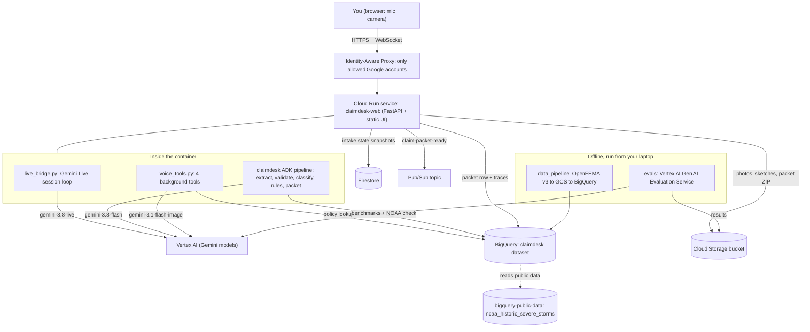
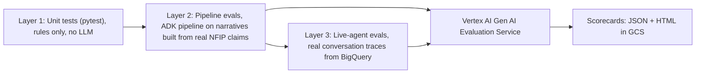

# Implementation Plan: gemini-live-adk-flood-claims ("Demo Tideline", code name `claimdesk`)

> [!NOTE]
> **Status: code generated, not deployed.** All code, SQL, tests, eval assets, deploy scripts and docs now exist in this folder. **No GCP resources have been created.** Deployment is manual, from Cloud Shell; see `RUNBOOK.md`.

> [!IMPORTANT]
> **Changes since the first draft of this plan.** Where the sections below disagree with this list, this list wins.
> 1. **Pub/Sub removed.** There is no `handoff.py` and no topic. The packet goes to a GCS ZIP plus a BigQuery `intake_packets` row (`webapp/packet_archive.py`). Script `03` is now `03_storage_firestore_bigquery.sh`.
> 2. **ADK Workflow API instead of `SequentialAgent`.** `SequentialAgent` is deprecated in ADK 2.x. `claimdesk/intake_pipeline.py` uses a graph `Workflow`: LLM nodes, function nodes, a parallel fan-out of the three BigQuery look-ups, and a `JoinNode`.
> 3. **Regions fixed (revised).**
>    - **Every GCP resource is in `us-central1`**, BigQuery included. NOAA and ZIP public data are copied in by the data pipeline.
>    - **All models use the `global` endpoint.** Live falls back once to `us-central1` if `global` is unavailable for the project.
> 8. **One config file.** `.env` drives the app, the deploy scripts (`deploy/00_variables.sh`) and Cloud Run (`--env-vars-file`, via `deploy/render_env_yaml.py`). Brand, supported states and limits are configurable.
> 9. **Branded UI** for the fictitious insurer **Demo Tideline** (renamed from *My Insurance*; the name must start with "Demo"). The name is configurable with `CLAIMDESK_BRAND_NAME`. The Cloud Run service, service account and image repo are `demo-tideline`, `demo-tideline-run` and `demo-tideline`. The internal code name stays `claimdesk`.
> 10. **Accuracy package.**
>     - **Agent Skill** `skills/nfip-flood-intake`, in ADK skill format and loaded by `claimdesk/knowledge.py`. It contains domain knowledge and worked examples, which are injected into the extractor, classifier and voice prompts. You can switch it off for A/B evals with `CLAIMDESK_USE_SKILL=false`.
>     - **Vertex AI Search grounding** on FEMA NFIP documents: `claimdesk/data_access/guidance_search.py`, the optional 5th voice tool `lookup_flood_guidance`, `grounding/` and `deploy/03b_vertex_ai_search.sh`. It runs in the **`us` multi-region**, the one documented exception to us-central1. Guide: `docs/grounding.md`.
> 11. **Destroy script** `deploy/99_destroy.sh`. RUNBOOK Phase 13 covers it.
> 12. **Testing is done in the deployed app only.** `docs/post_deployment_tests.md` lists the modality, what to say and the expected response for each test, including the grounding tests G-01…G-08.
> 4. **OpenFEMA v3 datasets** (`NfipPolicies`, `NfipClaims`). The v2 `FimaNfip*` endpoints are removed on 2026-10-15.
> 5. **No signed URLs.** Evidence files are streamed by the app, behind IAP.
> 6. **New docs:**
>    - `docs/cost_analysis.md`
>    - `docs/scaling_to_1000_users.md`
>    - `docs/architecture.md`
>    - `docs/data_loading.md`
>    - `docs/data_dictionary.md`
>    - `docs/evals.md`
>    - `docs/deploy_runbook.md`
> 7. **Live tools renamed:** `find_policy`, `refresh_intake_packet`, `capture_evidence_photo`, `render_damage_sketch`.

---

## 0. The short version

We are rebuilding the voice claim-intake agent from scratch under a new structure and new names. Changes from the original:

1. **Real public data** replaces the made-up policies and thresholds.
2. **Everything runs on Google Cloud**: Vertex AI for the models, BigQuery for data, Cloud Storage and Firestore for storage, Cloud Run for hosting.
3. **ADK** remains the "brain" that turns a conversation into a routed claim packet.
4. **The app is private.** It is reachable only by accounts you allow, through Identity-Aware Proxy (IAP).
5. **Evals are built in**, using the Vertex AI Gen AI Evaluation Service, so you learn the full build → evaluate → deploy loop.
6. **The same LLMs** as the original: `gemini-3.8-live`, `gemini-3.8-flash`, `gemini-3.1-flash-image`.

---

## 1. The dataset: FEMA NFIP v3, with NOAA Storm Events as a companion

### 1.1 Recommendation

| Role | Dataset | Where it lives | Size |
| --- | --- | --- | --- |
| **Primary: policies** | FEMA OpenFEMA **`NfipPolicies` v3** | OpenFEMA API → we load it into BigQuery | 74.7M rows (we load only a subset) |
| **Primary: claims** | FEMA OpenFEMA **`NfipClaims` v3** | OpenFEMA API → we load it into BigQuery | 2.73M rows |
| **Companion: weather check** | NOAA **Storm Events** | Already in BigQuery: `bigquery-public-data.noaa_historic_severe_storms.storms_YYYY` (2026 included) | Public dataset, nothing to load |

I checked all three live today (see 1.4).

### 1.2 Why this is the best fit

- **Same idea as the original.** The original's main demo is a flooded basement. NFIP (the National Flood Insurance Program) is the largest public, real insurance dataset in the world, and it is entirely about property water/flood losses. The app keeps doing the same job: voice intake, camera evidence, sketch, background claim team, routed packet. It now does it on real data.
- **Its fields map one-to-one onto what the original faked:**

  | Original fake field (`policy_directory.py`) | Real NFIP v3 field |
  | --- | --- |
  | `effective_period` | `policyEffectiveDate`, `policyTerminationDate` |
  | `status` (active / lapsed) | derived from termination date + `cancellationDateOfFloodPolicy` |
  | `coverages` | `totalBuildingInsuranceCoverage`, `totalContentsInsuranceCoverage` |
  | `deductibles` | `buildingDeductibleCode`, `contentsDeductibleCode` (decoded using FEMA's data dictionary) |
  | `policy_line` | `occupancyType`, `ratedFloodZone`, `primaryResidenceIndicator` |
  | location | `reportedCity`, `reportedZipCode`, `propertyState`, `censusGeoid` |

- **The claims data replaces hard-coded rules with evidence:**
  - `buildingDamageAmount` / `contentsDamageAmount` by state and `causeOfDamage` → **"is this estimate unusually high?"** uses the real 95th percentile instead of a fixed \$10k / \$25k.
  - `openDate − dateOfLoss` → **"was this reported unusually late?"** uses the real distribution instead of a fixed 90 days.
  - `nonPaymentReasonBuilding` → real reasons flood claims get denied. These become grounded "coverage considerations".
  - `causeOfDamage`, `waterDepth`, `floodEvent` → realistic demo scenarios and eval cases.
- **NOAA gives a real-world check.** "Was heavy rain or a flood recorded in that county around that date?" The answer is a **soft signal** for the human adjuster. It never denies a claim.
- **No licensing risk.** US government data, public domain, fine for a blog.
- **Fully GCP-native.** Everything is queried from BigQuery.

### 1.3 Two honest caveats (both handled in the design)

> [!IMPORTANT]
> **Personal details are removed on purpose.** NFIP records have no names and no policy numbers. Each record does have a stable `id`. We keep **every insurance attribute real** and generate only the identity layer:
> - `policy_number` = a short, readable code derived from the real record `id` (for example `FLD-CO-7Q2K9M`).
> - `policyholder_name` = a fake name generated from the same `id` (same record → same name every time).
>
> The README will say this clearly.

> [!WARNING]
> **Flood is not the same as water backup.** NFIP covers *flood* (rising surface water). It does **not** cover a sump-pump backup or a burst pipe; homeowners policies cover those. The original's flagship example is a sump-pump failure. In v2 this becomes a teaching feature: a new rule classifies the water source, and if it is internal (pipe or sump), the agent explains politely that this is usually a homeowners claim and routes it to human triage. Other claim types (auto, theft, travel, medical) are **out of scope** for v2 and route to "human triage", because there is no equivalent real public data for them.

### 1.4 Checks already done

| Check | Result |
| --- | --- |
| `GET /api/open/v3/NfipPolicies` | 74,739,464 records, all fields listed above present |
| `GET /api/open/v3/NfipClaims` | 2,725,989 records, including `openDate`, `countyCode`, `nonPaymentReasonBuilding` |
| OpenFEMA **v2** | ⚠️ **Deprecated, removed 2026-10-15.** We use **v3** only (the v3 endpoint names drop the old `Fima` prefix). |
| `bq ls bigquery-public-data:noaa_historic_severe_storms` | `storms_2022` … `storms_2026` all present |

---

## 2. Target architecture



**How one conversation flows through it:**
1. You open the Cloud Run URL. IAP asks you to sign in with Google and lets you through only if your account is on the allow-list.
2. The browser opens a WebSocket to the app. The app opens a **Gemini Live** session on Vertex AI (no API key; it uses the Cloud Run service account).
3. While you talk, the live model calls background tools:
   - `lookup_policy` → **BigQuery** policy registry
   - `sync_claim_packet` → the **ADK pipeline**
   - `pin_evidence_photo` → frame saved to **Cloud Storage**
   - `draw_incident_sketch` → image model → **Cloud Storage**
4. The ADK pipeline extracts facts with `gemini-3.8-flash`, then applies rules. Some rules now query **BigQuery** (loss benchmarks, NOAA check).
5. The packet is saved to **Cloud Storage** (ZIP) and **BigQuery** (one row), and a message goes to **Pub/Sub** ("packet ready for an adjuster").
6. Every conversation's turns and tool calls are logged to **BigQuery**, and those traces feed the **evals** later.

### 2.1 Why these choices (and what I rejected)

| Decision | Choice | Why | Rejected alternative |
| --- | --- | --- | --- |
| Where ADK is used | ADK runs the **claim pipeline** (as in the original) | Its job has fixed steps, which suits a `SequentialAgent` with LLM steps plus plain-code rule steps | Moving the live voice loop into ADK `run_live`: unclear whether it supports `NON_BLOCKING` tools and `INTERRUPT` scheduling. Kept as an optional later experiment. |
| ADK session store | In-memory **per pipeline run**, with one shared `Runner` | Each pipeline run is a pure function of the transcript, so a persistent session adds latency and no value. The *results* are persisted in Firestore. | `VertexAiSessionService`: needs an Agent Engine resource; overkill here. |
| Intake state | **Firestore** (Native mode) | Simple document per intake; survives restarts; serverless | Cloud SQL: needs a server and connection management |
| Photos and packets | **Cloud Storage** | Cheap, private; the app streams files back through itself (no public links) | Signed URLs: they bypass IAP, so they break "fully private" |
| Policy lookup | Python function running a **parameterized BigQuery query** | Easy for a beginner to read and test; safe from SQL injection | MCP Toolbox for Databases: elegant, but a second service to deploy and learn |
| Private access | Cloud Run `--no-allow-unauthenticated` + **IAP** allow-list | Managed Google sign-in, no custom auth code, works in the browser, and mic/camera get HTTPS | `gcloud run services proxy`: private, but only from your laptop terminal |
| Deployment | **Manual** `gcloud` commands in a runbook | You asked to do it by hand and learn each step | `agents-cli deploy` / Terraform |
| Evals | **Vertex AI Gen AI Evaluation Service** (through `agents-cli eval`) + plain pytest for rules | Managed LLM-as-judge and trajectory metrics; results stored in GCS | Custom scripts only |
| Models | Unchanged: `gemini-3.8-live`, `gemini-3.8-flash`, `gemini-3.1-flash-image` | Your requirement | — |

---

## 3. GCP services you will use (glossary)

| Service | What it is, in one line | What we use it for |
| --- | --- | --- |
| **Vertex AI** | Google Cloud's managed AI platform | Calls all three Gemini models using the service account (no API key) |
| **Vertex AI Gen AI Evaluation Service** | Managed "grader" for AI outputs | Scores the agent's behaviour (LLM-as-judge + our own metrics) |
| **BigQuery** | Serverless SQL data warehouse | Stores NFIP data, the policy registry, benchmarks, packets and traces; queries NOAA |
| **Cloud Storage (GCS)** | Object/file storage | Raw OpenFEMA files, photos, sketches, packet ZIPs, eval results |
| **Firestore** | Serverless document database | The live state of each intake (like a JSON file per claim) |
| **Pub/Sub** | Messaging queue | Announces "packet ready" to downstream systems |
| **Cloud Run** | Runs your container; scales to zero | Hosts the web app and agent |
| **Artifact Registry** | Private container image store | Holds the app's Docker image |
| **Cloud Build** | Builds container images in the cloud | Turns the `Dockerfile` into an image |
| **Identity-Aware Proxy (IAP)** | Google sign-in gate in front of an app | Only your allow-listed accounts can open the app |
| **IAM / service accounts** | Who can do what | A dedicated, least-privilege identity for the app |
| **Cloud Logging / Cloud Trace** | Logs and request timing | Debugging; see how long each tool call takes |

### 3.1 Service accounts and permissions (least privilege)

| Identity | Roles | Why |
| --- | --- | --- |
| `claimdesk-run@PROJECT.iam.gserviceaccount.com` (the app) | `roles/aiplatform.user` | Call Gemini on Vertex AI |
| | `roles/bigquery.jobUser` (project) + `roles/bigquery.dataViewer` (on the `claimdesk` dataset) | Run queries and read the registry and benchmarks |
| | `roles/bigquery.dataEditor` (on `claimdesk.intake_packets` and `claimdesk.conversation_traces` only) | Write packets and traces |
| | `roles/storage.objectAdmin` (on the one bucket only) | Save and read photos and packets |
| | `roles/datastore.user` | Read/write Firestore |
| | `roles/pubsub.publisher` (on the one topic only) | Publish "packet ready" |
| | `roles/cloudtrace.agent`, `roles/logging.logWriter` | Traces and logs |
| **You** (`you@example.com`, i.e. `DEPLOY_IAP_USER_EMAIL`) | `roles/iap.httpsResourceAccessor` on the Cloud Run service | Open the private app |
| IAP service agent | `roles/run.invoker` on the service | Lets IAP forward your requests to Cloud Run |

> Nobody gets `allUsers` or `allAuthenticatedUsers`. That is what "no public access" means in practice.

---

## 4. New project layout and old → new file mapping

### 4.1 Folder tree (to be created in later phases)

```text
gemini-live-adk-flood-claims/
├── README.md                       # What it is, how to run, dataset attribution
├── pyproject.toml                  # Dependencies, managed with `uv`
├── .env.example                    # Vertex AI project/region, bucket, dataset names (no secrets)
├── Dockerfile / .dockerignore      # Container for Cloud Run
├── docs/
│   ├── IMPLEMENTATION_PLAN.md      # This document
│   ├── architecture.md             # Diagrams + design decisions
│   ├── data_dictionary.md          # NFIP field and code meanings we rely on
│   └── deploy_runbook.md           # Step-by-step manual gcloud commands
│
├── claimdesk/                      # The ADK app package ("the brain")
│   ├── __init__.py                 # Exposes `root_agent` for ADK tools and evals
│   ├── settings.py                 # Reads env vars: model IDs, project, dataset, bucket
│   ├── contracts.py                # Pydantic data models (claim, validation, packet...)
│   ├── intake_pipeline.py          # The ADK SequentialAgent + `run_intake_pipeline()`
│   ├── prompts/
│   │   ├── fact_extractor.md       # Instruction for the extraction LLM step
│   │   └── claim_classifier.md     # Instruction for the classification LLM step
│   ├── rules/
│   │   ├── required_fields.py      # "Do we have name, policy, date, location...?"
│   │   ├── evidence_rules.py       # Document checklist + evidence gates
│   │   ├── water_source.py         # NEW: flood vs internal water (pipe/sump)
│   │   ├── risk_signals.py         # Timing, high-loss, safety, SIU signals
│   │   └── packet_writer.py        # Builds the Markdown adjuster packet
│   └── data_access/
│       ├── bq_client.py            # One shared BigQuery client + query helper
│       ├── policy_registry.py      # lookup_policy() against BigQuery
│       ├── loss_benchmarks.py      # "Is this estimate / delay unusual?" from NFIP claims
│       └── weather_events.py       # NOAA Storm Events check
│
├── webapp/                         # The voice/camera application
│   ├── main.py                     # FastAPI app: routes, startup, health check
│   ├── live_bridge.py              # Browser WebSocket ↔ Gemini Live loop
│   ├── voice_tools.py              # Live system prompt + 4 tool declarations
│   ├── tool_handlers.py            # What each tool actually does when called
│   ├── intake_store.py             # Firestore read/write of intake state
│   ├── evidence_store.py           # Cloud Storage for photos, sketches, ZIP
│   ├── handoff.py                  # BigQuery packet row + Pub/Sub message
│   ├── trace_logger.py             # Turns + tool calls → BigQuery (feeds evals)
│   └── static/
│       ├── index.html
│       ├── claim.js                # Front-end logic (call, voice orb, camera, claim panel)
│       └── claim.css
│
├── data_pipeline/                  # One-time data loading (run from your laptop)
│   ├── fetch_openfema.py           # Download NFIP v3 subsets → GCS
│   ├── load_to_bigquery.py         # GCS files → BigQuery raw tables
│   └── sql/
│       ├── 10_policy_registry.sql  # Real policies + generated number/name
│       ├── 20_loss_benchmarks.sql  # Percentiles by state / cause / occupancy
│       ├── 30_report_lag.sql       # Loss-to-report delay distribution
│       └── 40_eval_seed_claims.sql # Sample real claims for eval cases
│
├── evals/
│   ├── build_eval_cases.py         # Real NFIP claim rows → claimant narratives + expected answers
│   ├── datasets/
│   │   ├── pipeline_core.json      # ~10 cases to start
│   │   └── pipeline_edge.json      # water-backup, lapsed, late report, injury...
│   ├── eval_config.yaml            # Which metrics to run (built-in + custom)
│   └── export_live_traces.py       # BigQuery traces → eval trace format
│
├── tests/                          # Deterministic tests (no LLM calls)
│   ├── test_required_fields.py
│   ├── test_evidence_rules.py
│   ├── test_water_source.py
│   ├── test_risk_signals.py
│   ├── test_policy_registry.py     # BigQuery mocked
│   └── test_desk_ui.cjs            # Browser state tests
│
└── deploy/
    ├── 00_variables.sh             # PROJECT_ID, REGION, names, all in one place
    ├── 01_enable_apis.sh
    ├── 02_service_account_iam.sh
    ├── 03_storage_firestore_pubsub.sh
    ├── 04_build_image.sh
    ├── 05_deploy_cloud_run.sh
    └── 06_enable_iap.sh
```

> The `deploy/*.sh` files are **reference scripts you run by hand, one at a time**. Each command is explained in `deploy_runbook.md`. Nothing runs automatically.

### 4.2 Old → new mapping (so you can see nothing was lost)

| Original file | New location | What changes |
| --- | --- | --- |
| `agent.py` | `claimdesk/intake_pipeline.py` (+ `prompts/*.md`) | Prompts move into files; one shared `Runner`; adds BigQuery-backed rule steps |
| `schemas.py` | `claimdesk/contracts.py` | Adds a `home_flood` claim type, `WaterSource`, benchmark and weather-check results |
| `policies.py` (736 lines) | Split into `claimdesk/rules/*.py` | One file per responsibility; thresholds come from BigQuery instead of constants |
| `policy_directory.py` | `claimdesk/data_access/policy_registry.py` | Dict → parameterized BigQuery query |
| `examples.py` | `evals/datasets/*.json` + README demo lines | Built from real NFIP claim rows |
| `live_demo/server.py` (~1,080 lines) | `webapp/main.py`, `live_bridge.py`, `tool_handlers.py`, `intake_store.py`, `evidence_store.py`, `handoff.py`, `trace_logger.py` | Split by responsibility; memory → Firestore/GCS; loopback-only checks replaced by IAP |
| `live_demo/live_tools.py` | `webapp/voice_tools.py` | Same four tools; prompt updated for flood vs water backup |
| `live_demo/app.js`, `styles.css`, `index.html` | `webapp/static/claim.js`, `claim.css`, `index.html` | Rewritten to match the new API routes |
| `tests/test_regressions.py`, `client-regressions.cjs` | `tests/test_*.py`, `test_desk_ui.cjs` | One test file per rule module |
| `requirements.txt` | `pyproject.toml` (with `uv`) | Adds `google-cloud-bigquery`, `-storage`, `-firestore`, `-pubsub` |
| `.env.example` | `.env.example` | Vertex AI only; no API key |

---

## 5. Phases

Each phase lists what you learn, what gets built, and how we know it's done. I will stop for your review at the end of every phase.

### Phase 0: Project setup and checks (no code)
- **Learn:** GCP project basics, `gcloud` config, Application Default Credentials (ADC).
- **Do:**
  1. Pick the GCP project and region.
  2. Run `gcloud auth application-default login`.
  3. Enable APIs: `aiplatform`, `bigquery`, `storage`, `firestore`, `pubsub`, `run`, `artifactregistry`, `cloudbuild`, `iap`, `cloudtrace`, `logging`.
  4. **Confirm all three models are available on Vertex AI in your region.** The Live model in particular may only be offered in certain regions or `global`.
- **Done when:** a 5-line test script gets a reply from each of the three models through Vertex AI.

> [!CAUTION]
> If `gemini-3.8-live` is not available in the region you pick, the whole design depends on choosing a region where it is. We will settle this in Phase 0 before writing any app code.

### Phase 1: Data foundation (BigQuery)
- **Learn:** loading public data, BigQuery datasets and tables, partitioning, SQL views.
- **Do:**
  1. `fetch_openfema.py`: page through the OpenFEMA v3 API with a filter, for a small set of states (proposed: CO, TX, FL, LA, NC) and recent policy terms (effective date 2024-01-01 or later). Write newline-delimited JSON to `gs://BUCKET/raw/openfema/...`.
  2. `load_to_bigquery.py`: load into `claimdesk.raw_nfip_policies` and `claimdesk.raw_nfip_claims`.
  3. SQL builds:
     - `policy_registry` table: real attributes + generated `policy_number` and `policyholder_name` + derived `status`.
     - `loss_benchmarks` (p50/p90/p95 of damage by state × cause × occupancy).
     - `report_lag_benchmarks`.
     - `eval_seed_claims` (about 50 varied real claims).
  4. Write `docs/data_dictionary.md`, decoding the NFIP codes we use (deductible codes, `causeOfDamage`, `occupancyType`, `nonPaymentReason*`) from FEMA's official data dictionary.
- **Done when:** `SELECT * FROM claimdesk.policy_registry LIMIT 5` returns readable, realistic policies, and a README table lists 5 demo policy numbers drawn from real rows.
- **Cost note:** a filtered subset is a few GB at most, typically within BigQuery's free tier for storage and queries at this scale.

### Phase 2: ADK claim pipeline (the "brain")
- **Learn:** ADK `LlmAgent`, `SequentialAgent`, custom deterministic agents, `output_schema`, session state, running ADK programmatically.
- **Do:**
  - Build `contracts.py`, the `prompts/`, and `intake_pipeline.py`.
  - Pipeline steps:
    `ExtractFacts (LLM)` → `CheckRequiredFields` → `ClassifyClaim (LLM)` → `ClassifyWaterSource` → `CheckEvidence` → `ScoreRiskSignals (BigQuery benchmarks + NOAA)` → `WritePacket`.
  - Rules are rewritten as small pure functions. Thresholds come from `loss_benchmarks.py`, with a safe fallback if BigQuery is unreachable.
  - The NOAA check produces `CORROB-001`, a soft signal that says "no recorded storm or flood event near this date and county; confirm the cause". It never changes routing to a denial.
  - Deterministic pytest for every rule module.
- **Done when:**
  - `uv run pytest` passes.
  - `adk web` (ADK's local dev UI) runs the pipeline on a sample narrative and shows each step's state.

### Phase 3: Live voice web app (local)
- **Learn:** the Gemini Live API on Vertex AI, WebSockets in FastAPI, `NON_BLOCKING` tools and response scheduling.
- **Do:**
  - Build `webapp/`: same features as the original (talk, type, camera, pin photo, sketch, notebook, stamp, ZIP download).
  - Uses Vertex AI (`GOOGLE_GENAI_USE_VERTEXAI=True`).
  - In this phase intake state is still in memory, to keep the first run simple.
- **Done when:** on `localhost` you can hold a flood claim conversation. The agent looks up a **real-data** policy, pins a camera frame, draws a sketch, and the notebook fills in.

### Phase 4: Storage, handoff and traces (make it production-shaped)
- **Learn:** Firestore, Cloud Storage, Pub/Sub, writing to BigQuery from an app.
- **Do:**
  - `intake_store.py` (Firestore).
  - `evidence_store.py` (GCS). Photos are served back through the app, so they stay behind IAP.
  - `handoff.py`: packet ZIP → GCS, one row → `claimdesk.intake_packets`, message → Pub/Sub `claim-packet-ready`.
  - `trace_logger.py`: every turn and tool call → `claimdesk.conversation_traces`.
- **Done when:** after a conversation you can see the photo in the bucket, the packet row in BigQuery and the message on a test Pub/Sub subscription. Restarting the server does not lose the intake.

### Phase 5: Evals (GCP-native)
See [section 6](#6-eval-design-in-detail) for the full design.
- **Learn:** building eval datasets, built-in vs custom metrics, LLM-as-judge, the eval → fix → re-eval loop.
- **Done when:** a baseline scorecard exists for the pipeline and the live agent, at least one improvement round has been done, and before/after results are saved in GCS.

### Phase 6: Containerize and deploy to Cloud Run (manual)
- **Learn:** Dockerfile, Artifact Registry, Cloud Build, Cloud Run settings for a WebSocket app.
- **Do (by hand, following `deploy_runbook.md`):**
  1. Create the service account and grant the roles in 3.1.
  2. Create the bucket, Firestore database and Pub/Sub topic.
  3. `gcloud builds submit` → image in Artifact Registry.
  4. `gcloud run deploy claimdesk-web` with:
     - `--no-allow-unauthenticated`
     - `--service-account claimdesk-run@…`
     - `--timeout 3600` (long WebSocket calls)
     - `--session-affinity`
     - `--min-instances 0` and `--max-instances 1` (in-flight live calls stay on one instance; fine for a personal demo)
     - `--cpu 1`, `--memory 2Gi`
     - env vars for project, region, bucket and dataset
- **Done when:** the service shows **Ready** and opening its URL without signing in is refused (403).

### Phase 7: Make it private with IAP
- **Learn:** IAP on Cloud Run, the OAuth consent screen, IAM for users.
- **Do:**
  1. Enable IAP on the service.
  2. Grant **only your account** `roles/iap.httpsResourceAccessor`.
  3. Grant the IAP service agent `run.invoker`.
  4. Confirm no `allUsers` bindings exist.
- **Done when:**
  - You can open the app in Chrome, sign in, and hold a full voice + camera call (WebSocket through IAP).
  - An incognito window with another account is refused.
- **Optional hardening (discuss later):** ingress `internal-and-cloud-load-balancing` behind a load balancer, VPC Service Controls.

### Phase 8: Observe and evaluate the deployed app
- **Learn:** Cloud Logging queries, Cloud Trace spans, running evals against production traces.
- **Do:**
  - Turn on ADK/OpenTelemetry export to Cloud Trace.
  - Save useful log queries in the runbook.
  - Re-run the live-agent eval on traces from the deployed app.
- **Done when:** you can see one conversation end-to-end in Cloud Trace (Live turn → tool → BigQuery → Gemini) and have a post-deploy eval scorecard.

### Phase 9: Documentation for the blog
- README, architecture diagram, data attribution ("Data: FEMA OpenFEMA NFIP v3; NOAA Storm Events via BigQuery public datasets"), screenshots, and "what I learned".

---

## 6. Eval design in detail

"Evals" means **measuring whether the agent behaves correctly**, not just whether the code runs. We use three layers:



### Layer 1: Deterministic unit tests (pytest)
- **What:** Given fixed inputs, do the rules give the same answer every time? For example, "loss after the termination date → `policy_review`" or "sump pump → `internal_water` → human triage".
- **Why:** rules must be exact. No LLM is involved, so no "judge" is needed.

### Layer 2: Pipeline evals (the ADK brain)
- **Where the cases come from (the real-data part):**
  1. Take a real row from `eval_seed_claims`, e.g. "CO, 2025-07-14, cause = rainfall accumulation, water depth 8 in, building damage \$23,400".
  2. `gemini-3.8-flash` writes a **natural claimant narrative** from those facts. Some cases get deliberate twists: vague date, missing ZIP, a mentioned injury, a sump-pump cause.
  3. The **expected answers** come from the real row plus our rules. We know the true date, location and amount, and which routing the rules *should* produce.
- **Metrics:**

  | Metric | Type | Checks |
  | --- | --- | --- |
  | `fact_extraction_accuracy` | custom code metric (Python) | Did the extractor get date, ZIP/city, cause and amount right versus the real row? |
  | `routing_correct` | custom code metric | Does the final routing equal the expected routing? |
  | `water_source_correct` | custom code metric | Flood vs internal water classified correctly? |
  | `no_coverage_promise` | custom LLM-judge metric | Does the packet avoid promising coverage, payment or liability? |
  | `hallucination` | built-in | Does the packet contain facts not present in the narrative? |
  | `final_response_quality` | built-in (adaptive rubric) | Is the adjuster summary clear and complete? |

- **How it runs:**
  - `agents-cli eval generate` runs the ADK pipeline over the dataset.
  - `agents-cli eval grade` scores with the **Vertex AI Gen AI Evaluation Service**.
  - `agents-cli eval compare` checks before vs after a change.
  - For larger runs, `eval submit --dest gs://BUCKET/evals/` runs grading server-side and stores results in GCS.

### Layer 3: Live-agent evals (the voice agent)
- **Why separate:** the live voice agent is not an ADK agent. It is a Gemini Live session, so we evaluate its **recorded conversations**.
- **How:**
  1. Hold scripted typed conversations (for repeatability) with the local or deployed app. `trace_logger.py` stores them in BigQuery.
  2. `export_live_traces.py` converts them into the eval trace format.
  3. Grade the existing traces with `agents-cli eval grade` using:
     - built-in `multi_turn_tool_use_quality`: were the right tools called, with sensible arguments?
     - built-in `multi_turn_task_success`: was the intake completed?
     - custom `camera_honesty` (LLM judge): does the agent avoid confirming damage it can't see?
     - custom `topic_discipline` (LLM judge): does it finish the current topic before asking checklist items?
- **Note on bias:** the same model family writes narratives and is evaluated. This is acceptable for learning, and we will call it out. A few hand-written cases in `pipeline_edge.json` offset it.

---

## 7. Manual deployment runbook (outline)

The full commands, each with a plain-English explanation, will live in `docs/deploy_runbook.md`. Order:

1. `00_variables.sh`: `PROJECT_ID`, `REGION`, `SERVICE=claimdesk-web`, `BUCKET`, `BQ_DATASET=claimdesk`, `SA=claimdesk-run`.
2. `01_enable_apis.sh`: `gcloud services enable …`
3. `02_service_account_iam.sh`: create the SA; grant the roles in 3.1 (scoped to the bucket, dataset or topic where possible).
4. `03_storage_firestore_pubsub.sh`: bucket (uniform access, public access prevention **enforced**), Firestore Native DB, Pub/Sub topic + test subscription.
5. `04_build_image.sh`: Artifact Registry repo + `gcloud builds submit`.
6. `05_deploy_cloud_run.sh`: `gcloud run deploy` with the flags in Phase 6.
7. `06_enable_iap.sh`: enable IAP on the service, grant your account access, verify there are no public bindings.
8. **Verification checklist:** unauthenticated `curl` → 403; browser with your account → app loads; voice call works; photo lands in the bucket; packet row in BigQuery.
9. **Rollback:** `gcloud run services update-traffic --to-revisions=PREVIOUS=100`.
10. **Tear-down:** commands to delete everything, so you don't pay for idle resources.

---

## 8. Risks and how we handle them

| Risk | Impact | Mitigation |
| --- | --- | --- |
| Live model not available in the chosen Vertex AI region | Blocks the app | Checked in **Phase 0** before any code |
| WebSocket behaviour through IAP | Voice call might drop | Tested early in Phase 7; `--timeout 3600`, session affinity, reconnect logic kept from the original |
| OpenFEMA v2 removal on 2026-10-15 | Old endpoints break | We use **v3 only** |
| Full NFIP policies table is 74.7M rows | Load time and cost | Load a filtered subset (a few states, recent terms) |
| NFIP excludes water backup | Demo confusion | Explicit `water_source` rule + clear agent explanation |
| Generated names could look like real people | Privacy perception | Obviously fictional name generator + README disclosure |
| More than one Cloud Run instance splits a live call | Broken session | `--max-instances 1` for the demo; Firestore + GCS make scaling up possible later |

---

## 9. Decisions (answered)

| # | Question | Decision |
|---|---|---|
| 1 | GCP project | Your own project. It's set in `deploy/00_variables.sh` and `.env`, and nothing is hard-coded. |
| 2 | Region | **`us-central1` for every GCP resource**: Cloud Run, GCS, Firestore, Artifact Registry and BigQuery. **`global` for all model endpoints**, with a Live fallback to `us-central1`. |
| 3 | States | **CO, TX, FL, LA, NC.** |
| 4 | Scope | **Flood-only (NFIP-style)**, with other claims routed to human triage. This is called out in the README, `docs/architecture.md`, `docs/data_dictionary.md`, the packet itself (`SCOPE_NOTE`), and the UI banner. |
| 5 | IAP allow-list | **Just your account.** No groups. |
| 6 | Pub/Sub | **Dropped for now.** |
| – | Model Armor | Deferred. |
| – | Deployment | Manual only (`deploy/` scripts plus `docs/deploy_runbook.md`). |
| – | Scale | Single user now. The path to 1,000 users is in `docs/scaling_to_1000_users.md`. |
| – | Cost | See `docs/cost_analysis.md`. |
