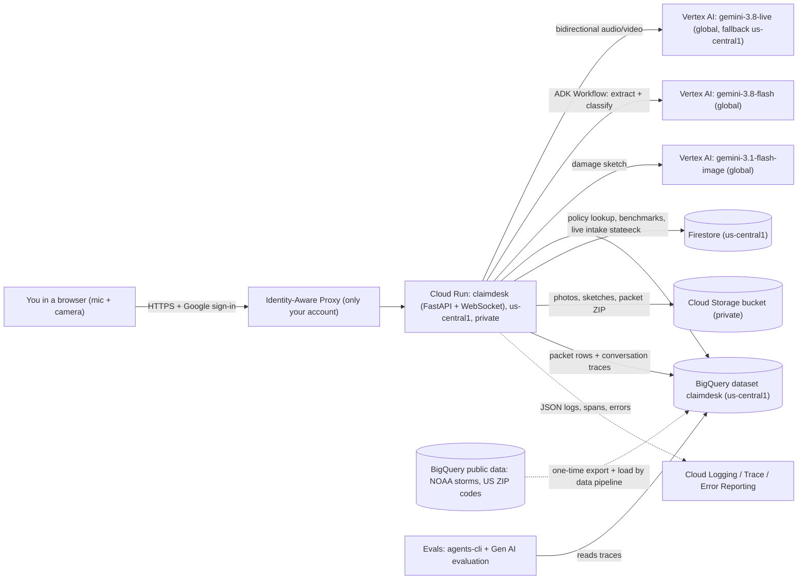
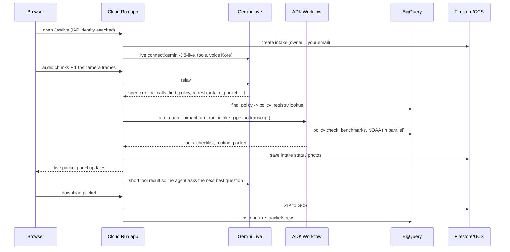
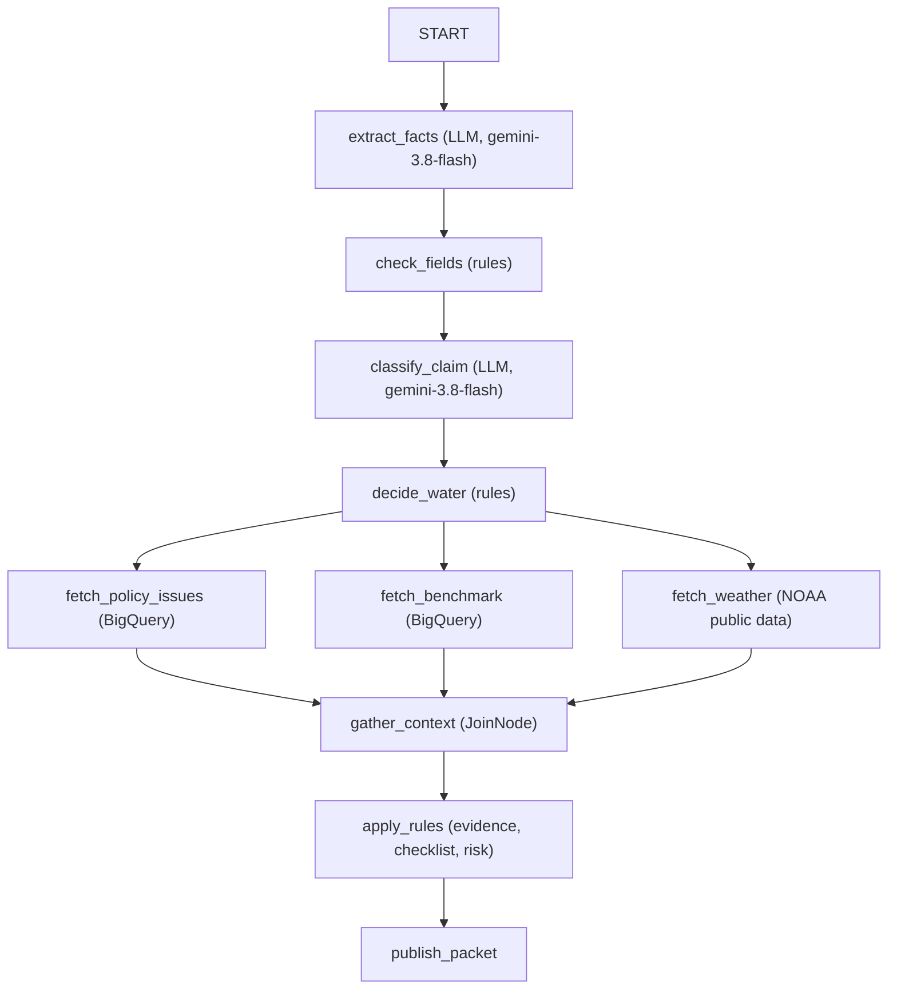

# Architecture

> [!IMPORTANT]
> **Scope.** ClaimDesk is a **learning demo** for **residential flood claims (NFIP-style)** in five states: **CO, TX, FL, LA, NC**. Claims about other perils (fire, auto, theft, wind-only) are recognised and routed to a human as out of scope.
> **Identities.** Policies are built from **real FEMA OpenFEMA NFIP records**: dates, coverage, deductibles, flood zone, city and ZIP. FEMA publishes no names or policy numbers, for privacy. The **policy numbers (`FLD-TX-7Q2K9M`) and policyholder names are generated** deterministically and are fictional.
> This product uses the FEMA OpenFEMA API but is not endorsed by FEMA. Nothing here is a coverage decision.

## 1. The big picture



## 2. Components and why each was chosen

| Layer | GCP service | Why this one |
|---|---|---|
| Access control | **IAP** + Cloud Run IAM (`--no-allow-unauthenticated`) | Private with zero auth code. Google sign-in, and an allow-list of exactly one user. |
| Web app | **Cloud Run** (FastAPI, uvicorn) | Serverless containers with WebSocket support and scale-to-zero. Deployment is just a container image. |
| Voice agent | **Gemini Live on Vertex AI** (`gemini-3.8-live`, voice Kore) | Real-time, interruptible speech in and out, plus camera frames and tool calls. |
| Reasoning pipeline | **ADK 2.x Workflow**: 2 `LlmAgent` nodes and deterministic function nodes | The LLM does what only it can do (understand language). Code does what must be predictable (rules and routing). Testable offline. |
| Reference data | **BigQuery** (`us-central1`) | Loaded once from public FEMA data, then transformed with SQL. A filtered copy of the Google-hosted NOAA and ZIP public data (supported states only) is exported and loaded here, so every query stays in-region. |
| Live state | **Firestore** (Native) | Millisecond document reads and writes. Survives container restarts. TTL cleanup. |
| Files | **Cloud Storage** | Cheap and durable. Public access prevention. Lifecycle deletion. |
| Observability | **Cloud Logging** (structured JSON), **Error Reporting**, **Cloud Trace** (OpenTelemetry) | Native, and nearly free at this scale. See §6. |
| Domain knowledge | **ADK Agent Skill** `skills/nfip-flood-intake` (loaded with `google.adk.skills.load_skill_from_dir`) | Flood definition, water-source table, documents, safety, approved language and worked examples, versioned apart from code and injected into all three prompts. See [grounding.md](grounding.md). |
| Grounding | **Vertex AI Search** (Discovery Engine), `us` multi-region | Managed PDF parsing, chunking, indexing and ranking of FEMA NFIP documents. There's no vector database to run. Called by the `lookup_flood_guidance` voice tool over REST. |
| Evals | **agents-cli / ADK eval** and the **Vertex AI Gen AI evaluation service** | Native to GCP. Results go to BigQuery and the Console. |
| Build | **Cloud Build** → **Artifact Registry** (us-central1) | No local Docker needed. The image lives next to Cloud Run. |

**Not used yet, by your choice:** Pub/Sub (packets go straight to GCS and BigQuery) and Model Armor.

## 3. Regions

| What | Location | Reason |
|---|---|---|
| Cloud Run, Artifact Registry, GCS bucket, Firestore | `us-central1` | Your chosen region. Everything that talks every second sits together. |
| `gemini-3.8-flash`, `gemini-3.1-flash-image` | `global` endpoint | Best availability and fewest 429s. Google routes to wherever capacity exists. |
| `gemini-3.8-live` | `global`, with automatic one-time fallback to `us-central1` | Same endpoint policy as the other models. If your project can't open Live sessions on `global`, the app reconnects on `LIVE_MODEL_FALLBACK_LOCATION` and remembers the choice. Check in advance with `scripts/check_models.py`. |
| Vertex AI Search data store + engine (FEMA documents) | **`us` multi-region**: the one exception | Vertex AI Search only offers `global`, `us` and `eu`. `us` keeps the index and queries in the United States. Cloud Run in us-central1 calls `us-discoveryengine.googleapis.com`. |
| BigQuery dataset `claimdesk` | `us-central1` | Your region rule. BigQuery can't join across locations, and the NOAA and ZIP public datasets live in the `US` multi-region. So the data pipeline runs one `EXPORT DATA` job (job location `US`; it stores nothing there) that writes the filtered rows to our us-central1 bucket, then loads them into `noaa_flood_events` and `zip_points`. See data_loading.md. |

## 4. One call, step by step



## 5. The ADK workflow (the "brain")



Source: [intake_pipeline.py](../claimdesk/intake_pipeline.py). Rules live in [claimdesk/rules/](../claimdesk/rules/). Each rule has an ID (for example `SCOPE-001` or `TIMING-001`) that appears in the packet, so an adjuster can see why a route was chosen.

**Routing precedence:** `emergency_escalation` > `human_triage` > `special_investigation` > `policy_review` > `needs_docs` > `ready_for_adjuster`.

`human_triage` means "not a flood-desk claim". A person reviews those files anyway, so SIU signals stay visible in the packet but do not change the route.

## 6. Logging and error handling (GCP best practice)

| Practice | Implementation |
|---|---|
| **Structured JSON logs** | On Cloud Run, `google.cloud.logging.handlers.StructuredLogHandler` writes one JSON object per line to stdout. Cloud Logging parses `severity`, `message`, and custom `json_fields`. No API calls, no blocking. |
| **Request correlation** | Middleware reads `X-Cloud-Trace-Context` / `traceparent`. Every log line carries `logging.googleapis.com/trace`, so in Logs Explorer "show entries for this trace" gives the full story of one request. Each line also carries `intake_id`. |
| **Error Reporting** | Exceptions are logged once, at the boundary, with `logger.exception(...)`. The handler adds the `@type: ...ReportedErrorEvent` marker and `serviceContext` (service and revision), so Error Reporting groups them and can email you. |
| **Typed errors** | `claimdesk/errors.py`: `ClaimDeskError` has subclasses `DataAccessError`, `StorageError`, `ModelCallError`, and so on. Each carries a safe `user_message` and a `retryable` flag. Code wraps low-level errors with `raise X(...) from exc`, so the original cause stays in the traceback. |
| **Graceful degradation** | Non-critical look-ups (policy registry, benchmarks, NOAA) return "unavailable" instead of crashing the call. The rules then use conservative fallbacks. |
| **Tracing** | OpenTelemetry → `CloudTraceSpanExporter`. ADK emits spans for agent and LLM calls. Cloud Trace shows where time went (for example, which BigQuery node was slow). |
| **No secrets, minimal PII in logs** | ADC only (no API keys). `observability.redact()` masks emails and phones in logged text. |
| **Log levels** | INFO by default. DEBUG only temporarily, because logging over 50 GiB/month costs money. |

## 7. Security summary

- **Private by design.** IAP allow-list (only you), `--no-allow-unauthenticated`, and a public-access-prevented bucket. Files are streamed by the app; no signed URLs are issued.
- **Least privilege.** The `demo-tideline-run` service account has dataset-scoped and bucket-scoped roles only.
- **Defence in depth.** On Cloud Run the app **verifies the IAP-signed JWT** (`X-Goog-IAP-JWT-Assertion`: signature, issuer and audience `CLAIMDESK_IAP_AUDIENCE`, which deploy step 05 sets) and takes the user's email from the verified token, never from an unsigned header. Requests without a valid token are refused. Each intake belongs to the identity that created it.
- **Data.** Only public FEMA/NOAA data plus what you say or show in a test call. Traces expire after 30 days, files after 30 days, and Firestore documents by TTL.

## 8. Folder map

```
claimdesk/            ADK agent package (App name "claimdesk")
  intake_pipeline.py  Workflow graph + run_intake_pipeline()
  rules/              deterministic business rules (unit-tested)
  data_access/        BigQuery access (policy registry, benchmarks, NOAA)
  prompts/            LLM instructions (Markdown)
  settings.py, observability.py, errors.py, contracts.py
webapp/               Cloud Run app: FastAPI, Live bridge, tools, stores, UI
data_pipeline/        FEMA download + BigQuery load + SQL transforms
evals/                eval datasets, config, custom metrics, trace export
deploy/               numbered manual deployment scripts
scripts/              check_models.py (Phase 0)
docs/                 you are here
tests/                pytest + a small Node UI test
```
