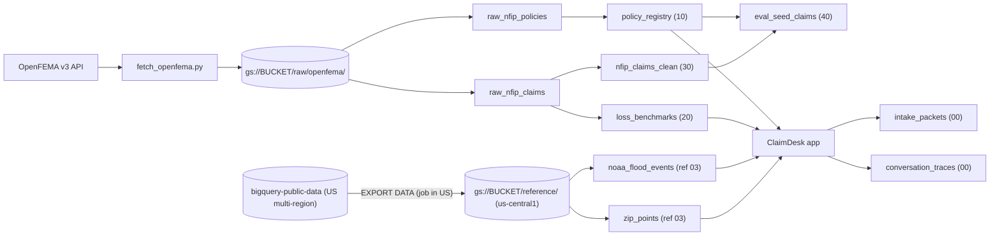

# Demo Tideline (`claimdesk`) data dictionary

This page describes every BigQuery table in the `claimdesk` dataset (location **`us-central1`**, like every other ClaimDesk resource): what each column means, where it comes from, and whether it is **real** FEMA data or **derived/generated** by our SQL.

> [!IMPORTANT]
> **Attribution.** This product uses the FEMA OpenFEMA API, but is not endorsed by FEMA. The Federal Government or FEMA cannot vouch for the data or analyses derived from these data after the data have been retrieved from the Agency's website(s).
>
> Sources:
> - FEMA OpenFEMA **NFIP v3**: [`NfipPolicies`](https://www.fema.gov/api/open/v3/NfipPolicies) (~74.7M rows) and [`NfipClaims`](https://www.fema.gov/api/open/v3/NfipClaims) (~2.73M rows). The old v2 `FimaNfip*` endpoints are removed on 2026-10-15, so we use v3 only.
> - NOAA Storm Events: `bigquery-public-data.noaa_historic_severe_storms.storms_YYYY`, **copied** (filtered) into `noaa_flood_events`.
> - US ZIP codes: `bigquery-public-data.geo_us_boundaries.zip_codes`, **copied** (filtered) into `zip_points`.

> [!WARNING]
> **Generated identities.** FEMA redacts NFIP data for privacy: there are **no names, no policy numbers, and no street addresses**, coordinates are rounded to 0.1°, and even `reportedCity` is blank in most v3 rows. So ClaimDesk **generates** two things from each real record `id`:
> - `policy_number`, for example `FLD-TX-7Q2K9M`
> - `policyholder_name`, for example `Avery Bennett`
>
> Both are **fictional**. They are computed with BigQuery's `FARM_FINGERPRINT` hash, so the same record always gets the same number and name, which keeps demos and evals repeatable. Any resemblance to a real person is coincidental. Every other policy attribute (dates, limits, deductibles, flood zone, ZIP) is real.

> [!NOTE]
> **Flood-only scope.** NFIP insures *flood*, meaning rising surface water from a river, the sea, or accumulated rain. It does **not** cover burst pipes, sump-pump failure, or sewer/drain backup; those are homeowners-policy losses. FEMA's own non-payment codes show this (`02` Seepage, `03` Backup drains, `16` Wind damage). ClaimDesk v2 therefore treats only residential flood as in scope and sends everything else to human triage. The registry, benchmarks and eval seeds keep only **residential** occupancy types (`1, 2, 3, 11, 12, 13, 14, 15, 16`).

**States loaded:** CO, TX, FL, LA, NC (setting `CLAIMDESK_SUPPORTED_STATES`; it drives both the FEMA download and the NOAA/ZIP copy). **Policies:** effective date within the last 365 days (rolling default of `--policies-since`, so most are still active), sampled up to `--max-per-state` (default 50,000) per state. **Claims:** date of loss 2015-01-01 or later, all rows.

## How the tables relate

Legend used below: **Real** means copied or renamed from FEMA. **Derived** means computed from real fields, for example a decoded code, a date difference or a status. **Generated** means fictional.

---

## 1. `raw_nfip_policies` (staging)

A 1:1 copy of the downloaded `NfipPolicies` v3 rows. The schema is in [`raw_nfip_policies.json`](../data_pipeline/schemas/raw_nfip_policies.json), and FEMA's field names are kept as they are. Dates are stored as **text** (`2025-01-01T00:00:00.000Z`) and parsed in SQL, so a load can never fail on a date format. The table is replaced on every load (`WRITE_TRUNCATE`). The app does not read it.

## 2. `raw_nfip_claims` (staging)

The same idea for `NfipClaims` v3 ([`raw_nfip_claims.json`](../data_pipeline/schemas/raw_nfip_claims.json)). Note that claims use the field `state` while policies use `propertyState`.

---

## 3. `policy_registry`

Built by [`10_policy_registry.sql`](../data_pipeline/sql/10_policy_registry.sql). It has one row per real residential policy term, is clustered by `policy_number_key`, and is read by [`policy_registry.py`](../claimdesk/data_access/policy_registry.py) (`lookup_policy`).

| Column | Type | Origin | Meaning |
| --- | --- | --- | --- |
| `policy_number` | STRING | **Generated** | `FLD-<STATE>-XXXXXX`. The 6 characters come from `23456789ABCDEFGHJKMNPQRSTVWXYZ` (no 0/O, 1/I/L, U, which speech-to-text confuses). Unique. |
| `policy_number_key` | STRING | Derived | `policy_number` uppercased with everything except A–Z/0–9 removed (`FLDTX7Q2K9M`). Same rule as `normalize_policy_number()`. The lookup filters on this. |
| `policyholder_name` | STRING | **Generated** | Fictional "First Last" picked from two 40-name lists by hash of `id`. |
| `status` | STRING | Derived | `cancelled` if `cancellationDateOfFloodPolicy` ≤ today, else `expired` if `policyTerminationDate` < today, else `pending` if `policyEffectiveDate` > today (term not started yet), else `active`. **Snapshot at build time**; rebuild to refresh it. |
| `policy_line` | STRING | Derived | From `occupancyType`: `NFIP Dwelling - Single Family` (1, 11), `NFIP Dwelling - 2-4 Family` (2, 12), `NFIP Dwelling - Manufactured Home` (14), `NFIP Dwelling - Residential Unit` (16), `NFIP General Property - Other Residential` (3, 13), `NFIP RCBAP - Condominium Association` (15). |
| `property_state` | STRING | Real | `propertyState`. |
| `reported_city` | STRING | Real / derived | `reportedCity` if FEMA provides it. Otherwise (most rows) the **NFIP community name** cleaned up: `HOUSTON, CITY OF` → `Houston`, `HARDIN COUNTY *` → `Hardin County`. Never NULL (`''` if unknown). |
| `reported_zip_code` | STRING | Real | First 5 digits of `reportedZipCode`. Rows without a ZIP are skipped. |
| `rated_flood_zone` | STRING | Real | `ratedFloodZone` (`AE`, `X`, `VE`, …). `''` if missing. |
| `effective_start` | DATE | Real | `policyEffectiveDate`. |
| `effective_end` | DATE | Real | `policyTerminationDate`. The app compares these with the **date of loss**, not with today. |
| `building_coverage_usd` | INT64 | Real | `totalBuildingInsuranceCoverage`. |
| `contents_coverage_usd` | INT64 | Real | `totalContentsInsuranceCoverage`. |
| `building_deductible_usd` | INT64 | Derived | Decoded `buildingDeductibleCode` (table below). NULL if no code. |
| `contents_deductible_usd` | INT64 | Derived | Decoded `contentsDeductibleCode`. NULL when there is no contents coverage. |
| `primary_residence` | BOOL | Real | `primaryResidenceIndicator`. |
| `source_record_id` | STRING | Real | The OpenFEMA `id` of the policy row, so you can trace any demo policy back to FEMA. |
| `cancellation_date` | DATE | Real | `cancellationDateOfFloodPolicy` (extra; not read by the app). |
| `occupancy_type` | INT64 | Real | `occupancyType` (extra). |
| `nfip_community_name` | STRING | Real | `nfipCommunityName` (extra). |
| `status_as_of` | DATE | Derived | The date `status` was computed. |

**Renewals.** FEMA gives each policy *term* its own `id`, and nothing links a renewal to the previous term. If a building renewed in 2026, it appears as two rows with two different generated numbers.

### Deductible codes

| Code | USD | Code | USD | Code | USD |
| --- | ---: | --- | ---: | --- | ---: |
| `0` | 500 | `5` | 5,000 | `D` | 25,000 |
| `1` | 1,000 | `9` | 750 | `E` | 50,000 |
| `2` | 2,000 | `A` | 10,000 | `F` | 1,250 |
| `3` | 3,000 | `B` | 15,000 | `G` | 1,500 |
| `4` | 4,000 | `C` | 20,000 | `H` | 200 (group flood policies only) |

---

## 4. `loss_benchmarks`

Built by [`20_loss_benchmarks.sql`](../data_pipeline/sql/20_loss_benchmarks.sql). It has one row per state plus one row with `state = 'ALL'`, computed from real residential claims with a loss date in 2015 or later. It is read by [`loss_benchmarks.py`](../claimdesk/data_access/loss_benchmarks.py), and `rules/risk_signals.py` uses the values as soft thresholds.

| Column | Type | Origin | Meaning |
| --- | --- | --- | --- |
| `state` | STRING | Derived | 2-letter state, or `ALL` (fallback for other states). |
| `sample_size` | INT64 | Derived | Number of claims with building + contents damage > 0. |
| `damage_p50_usd` | FLOAT64 | Derived | Median of `buildingDamageAmount + contentsDamageAmount` (damage > 0 only). |
| `damage_p90_usd` | FLOAT64 | Derived | 90th percentile of the same. |
| `damage_p95_usd` | FLOAT64 | Derived | 95th percentile. An estimate above this is *unusual* and goes to adjuster review; it is not treated as wrong. |
| `report_lag_p95_days` | FLOAT64 | Derived | 95th percentile of `openDate − dateOfLoss` in days (lags < 0 or > 3650 are ignored as data errors). |
| `report_lag_p50_days` | FLOAT64 | Derived | Median lag (extra). |
| `report_lag_sample_size` | INT64 | Derived | Claims used for the lag percentiles (extra). |
| `losses_from`, `losses_to` | DATE | Derived | Loss-date range covered (extra). |
| `built_at` | TIMESTAMP | Derived | When the table was built (extra). |

Percentiles use `APPROX_QUANTILES(x, 100)`, which is accurate to well under 1% at this sample size.

---

## 5. `nfip_claims_clean`

Built by [`30_claims_reference.sql`](../data_pipeline/sql/30_claims_reference.sql). It holds **all** occupancy types with a loss date in 2015 or later, uses snake_case names and decodes FEMA's codes. It is used for analysis and by `eval_seed_claims`; the app does not query it.

| Column | Origin | Meaning |
| --- | --- | --- |
| `source_claim_id` | Real | OpenFEMA claim `id`. |
| `state`, `reported_zip_code`, `county_code`, `census_geoid`, `nfip_community_name`, `latitude`, `longitude` | Real | Location (coordinates are rounded by FEMA). |
| `reported_city` | Real / derived | Same rule as in `policy_registry` (community-name fallback). |
| `date_of_loss`, `open_date`, `year_of_loss` | Real | `dateOfLoss`, `openDate` (when the claim was opened), `yearOfLoss`. |
| `report_lag_days` | Derived | `open_date − date_of_loss`. |
| `cause_of_damage_raw` | Real | `causeOfDamage` exactly as FEMA sent it. It can hold several codes, e.g. `2D`. |
| `cause_of_damage_primary_code` | Derived | First *physical* cause (`0`–`9`, `A`). `B`/`C`/`D` only describe claim handling, so they are used only when nothing else is present. |
| `cause_of_damage` | Derived | Label for the primary code (table below). |
| `cause_group` | Derived | `coastal` (1), `riverine` (2, 3, A), `rainfall` (4), `other`. |
| `flood_event` | Real | Named catastrophe, e.g. `2026-06-Arthur-TS`. Often NULL. |
| `water_depth_inches` | Real | `waterDepth`. FEMA notes that a few rows were entered in feet. The value `99` shows up often on claims closed without payment and looks like a "not recorded" placeholder, so treat it with caution. |
| `flood_water_duration_hours` | Real | `floodWaterDuration`. |
| `building_damage_usd`, `contents_damage_usd` | Real | Adjuster-estimated actual cash value of the damage. |
| `total_damage_usd` | Derived | Their sum (NULL treated as 0). |
| `amount_paid_building_usd`, `amount_paid_contents_usd`, `amount_paid_icc_usd` | Real | Amounts paid. They can be negative when a check was reissued. |
| `amount_paid_usd` | Derived | Building + contents paid. |
| `non_payment_reason_building_code`, `non_payment_reason_contents_code` | Real | 2-digit code (left-padded). |
| `non_payment_reason_building`, `non_payment_reason_contents` | Derived | Label (table below). |
| `claim_outcome` | Derived | `paid` (amount paid > 0), `closed_without_payment` (a non-payment code exists), or `unknown`. |
| `rated_flood_zone`, `occupancy_type`, `primary_residence` | Real | As in policies. |
| `is_residential` | Derived | Occupancy type in the residential set. |
| `building_coverage_usd`, `contents_coverage_usd` | Real | Limits at the time of loss. |
| `building_deductible_usd`, `contents_deductible_usd` | Derived | Decoded deductible codes. |
| `fema_as_of_date` | Real | When FEMA last refreshed the row. |

### `causeOfDamage` codes

| Code | Label |
| --- | --- |
| `0` | Other causes |
| `1` | Tidal water overflow |
| `2` | Stream, river, or lake overflow |
| `3` | Alluvial fan overflow |
| `4` | Accumulation of rainfall or snowmelt |
| `7` / `8` | Erosion – demolition / removal (only valid for losses before 1995-09-23) |
| `9` | Earth movement, landslide, land subsidence, sinkholes |
| `A` | Closed basin lake |
| `B` / `C` / `D` | Expedited claim handling: without site inspection / follow-up site inspection / remote-adjustment pilot |

### `nonPaymentReasonBuilding` / `nonPaymentReasonContents` codes

The first nine rows are the codes that matter most for a flood intake desk. Most of them are reasons why water damage was not treated as a covered flood loss.

| Code | Label |
| --- | --- |
| `01` | Damage below deductible |
| `02` | Seepage (not a flood) |
| `03` | Backup of drains (not a flood) |
| `06` | Not an actual flood |
| `12` | Hydrostatic pressure |
| `13` | Drainage clogged |
| `15` | Damage occurred before policy inception |
| `16` | Wind damage (not flood) |
| `20` | No demonstrable damage |
| `04`, `05`, `07`–`11`, `14`, `17`–`19`, `97`–`99` | Shrubs, sea wall, loss in progress, failure to pursue, debris only, fire, fence, boat piers, erosion/landslide/mudflow types, other, deleted, erroneous assignment |

The full list is in [`nfip_codes.py`](../data_pipeline/nfip_codes.py). A unit test keeps it identical to the SQL.

---

## 6. `eval_seed_claims`

Built by [`40_eval_seed_claims.sql`](../data_pipeline/sql/40_eval_seed_claims.sql) and consumed by `evals/build_eval_cases.py`. It contains about **200 real residential claims**, stratified by *state × cause group × paid/not paid*. Claims with a 2025+ loss date are preferred because the registry only holds 2025+ terms. Each claim is paired with a registry policy so that an eval conversation can quote a policy number the app will really find. The sample is deterministic: the same data always gives the same rows.

**What happened (real FEMA facts)**

| Column | Type | Meaning |
| --- | --- | --- |
| `eval_case_id` | STRING | `nfip-<source_claim_id>`. A stable id for the eval case. |
| `source_claim_id` | INT64 | OpenFEMA claim `id`. |
| `stratum` | STRING | `<STATE>\|<cause_group>\|paid` or `…\|not_paid`. |
| `state` | STRING | Loss state. |
| `date_of_loss` | DATE | Real date of loss. |
| `open_date` | DATE | When the claim was opened. |
| `report_lag_days` | INT64 | `open_date − date_of_loss`. |
| `reported_city` | STRING | City or community name (see `nfip_claims_clean`). |
| `reported_zip_code` | STRING | 5-digit ZIP of the loss. |
| `county_code` | STRING | County FIPS code. |
| `cause_of_damage_primary_code` | STRING | Primary cause code. |
| `cause_of_damage` | STRING | Cause label, e.g. `Stream, river, or lake overflow`. |
| `cause_group` | STRING | `coastal` / `riverine` / `rainfall` / `other`. |
| `flood_event` | STRING | Named event, or NULL. |
| `water_depth_inches` | FLOAT64 | Water depth in the building, inches (a few FEMA rows were entered in feet). |
| `water_depth` | FLOAT64 | Same value as `water_depth_inches` (short alias used by `evals/`). |
| `building_damage_usd` | FLOAT64 | Building damage. |
| `contents_damage_usd` | FLOAT64 | Contents damage. |
| `total_damage_usd` | FLOAT64 | Building + contents damage. Use this as the claimant's "estimate". |
| `amount_paid_building_usd` | FLOAT64 | Paid on building. |
| `amount_paid_contents_usd` | FLOAT64 | Paid on contents. |
| `amount_paid_usd` | FLOAT64 | Total paid. |
| `claim_outcome` | STRING | `paid` / `closed_without_payment` / `unknown`. |
| `non_payment_reason_building_code` | STRING | 2-digit code, or NULL. |
| `non_payment_reason_building` | STRING | Label, e.g. `Seepage (not a flood)`. Good for "internal water" edge cases. |
| `non_payment_reason` | STRING | Same value as `non_payment_reason_building` (short alias used by `evals/`). |
| `non_payment_reason_contents` | STRING | Label for contents. |
| `rated_flood_zone` | STRING | Flood zone. |
| `occupancy_type` | INT64 | Residential occupancy code. |
| `primary_residence` | BOOL | Primary residence flag. |

**The matched policy (generated identity, real terms)**

| Column | Type | Meaning |
| --- | --- | --- |
| `matched_policy_number` | STRING | Registry `policy_number` for the caller to quote. |
| `matched_policyholder_name` | STRING | Registry `policyholder_name` (fictional). |
| `matched_policy_status` | STRING | Registry status at build time. |
| `matched_policy_line` | STRING | Registry policy line. |
| `matched_policy_effective_start` | DATE | Policy term start. |
| `matched_policy_effective_end` | DATE | Policy term end. |
| `matched_policy_city` | STRING | City on the policy. It can differ from the claim when `match_level = 'state_and_term'`. |
| `matched_policy_zip_code` | STRING | ZIP on the policy. |
| `matched_building_coverage_usd` | INT64 | Building limit. |
| `matched_contents_coverage_usd` | INT64 | Contents limit. |
| `matched_building_deductible_usd` | INT64 | Building deductible. |
| `matched_contents_deductible_usd` | INT64 | Contents deductible. |
| `loss_within_policy_term` | BOOL | `date_of_loss` falls between the matched term's start and end. If FALSE, expect the rule "Loss date falls outside the recorded policy term". |
| `match_level` | STRING | `zip_and_term` (same ZIP, term covers the loss: best), `state_and_term` (same state, term covers the loss, different ZIP), `zip_only` (same ZIP, term does not cover the loss), or `state_only` (same state only: different ZIP and the term does not cover the loss; the last-resort match). |

> [!TIP]
> For "clean" eval cases, use `match_level = 'zip_and_term'` and `matched_policy_status != 'cancelled'`. For a lapsed-policy edge case, use `loss_within_policy_term = FALSE`. When `match_level = 'state_and_term'`, have the caller give the **policy's** ZIP/city (`matched_policy_zip_code`) so the facts stay consistent.

---

## 7. `intake_packets` (written by the app)

Created by [`00_create_dataset_and_tables.sql`](../data_pipeline/sql/00_create_dataset_and_tables.sql) and partitioned by `DATE(created_at)`. It has one row per adjuster hand-off packet. All values come from the app; none are FEMA data.

| Column | Type | Meaning |
| --- | --- | --- |
| `intake_id` | STRING | Server-generated intake id. |
| `created_at` | TIMESTAMP | When the packet was written (UTC). |
| `claim_type` | STRING | `home_flood` / `internal_water` / `out_of_scope` / `unclear`. |
| `routing_decision` | STRING | `ready_for_adjuster` / `needs_docs` / `policy_review` / `special_investigation` / `emergency_escalation` / `human_triage`. |
| `severity` | STRING | `low` / `medium` / `high` / `urgent`. |
| `intake_status` | STRING | `valid` / `missing_info`. |
| `policy_number` | STRING | As captured on the call. |
| `loss_state` | STRING | 2-letter state. |
| `loss_zip_code` | STRING | 5-digit ZIP. |
| `date_of_loss` | DATE | Date of loss. |
| `estimated_loss_usd` | FLOAT64 | The claimant's estimate. |
| `missing_count` | INT64 | Number of missing required facts. |
| `packet_gcs_uri` | STRING | `gs://` URI of the packet ZIP. |
| `packet_json` | STRING | Full packet as JSON text. |

## 8. `conversation_traces` (written by the app)

Partitioned by `DATE(event_time)`, clustered by `intake_id`, and **auto-deleted after 30 days** (`partition_expiration_days = 30`).

| Column | Type | Meaning |
| --- | --- | --- |
| `intake_id` | STRING | Intake the event belongs to. |
| `event_time` | TIMESTAMP | When it happened (UTC). |
| `seq` | INT64 | Order within the intake. |
| `event_type` | STRING | e.g. `turn`, `tool_call`, `tool_result`, `system`. |
| `role` | STRING | `user` / `agent` / `tool`. |
| `text` | STRING | Redacted transcript text. |
| `tool_name` | STRING | Tool called, if any. |
| `tool_args_json` | STRING | Tool arguments (JSON text). |
| `tool_result_json` | STRING | Tool result (JSON text). |
| `service_revision` | STRING | Cloud Run revision that served the call. |

---

## 9. `noaa_flood_events` (reference copy)

**Built by** [`sql/reference/01_export_noaa_flood_events.sql`](../data_pipeline/sql/reference/01_export_noaa_flood_events.sql) (export, job location `US`) and [`03_build_reference_tables.sql`](../data_pipeline/sql/reference/03_build_reference_tables.sql) (build, `us-central1`). **Read by** `claimdesk/data_access/weather_events.py`. **Grain:** one row per NOAA `event_id`. **Size:** ~17k rows for 5 states, 2015 to the latest month NOAA has published. **Partitioned** by month of `event_date`; **clustered** by `state_code, event_type`.

**Why a copy?** The public dataset lives in the `US` multi-region and our dataset in `us-central1`; BigQuery cannot join across locations. See [data_loading.md §3](data_loading.md#3-why-everything-is-in-us-central1-and-how-we-still-use-noaa-data). The copy is a snapshot, so refresh it with `load_to_bigquery --steps reference` ([§10b](data_loading.md#10b-refresh-reference-data)).

**Filter:** `event_type` is one of `claimdesk.data_access.weather_events.FLOOD_EVENT_TYPES` (Flash Flood, Flood, Heavy Rain, Coastal Flood, Lakeshore Flood, Storm Surge/Tide, Tropical Storm, Tropical Depression, Hurricane, Hurricane (Typhoon)), the state is in the supported states, and the year is 2015 or later (`--noaa-from-year`).

| Column | Type | Kind | Meaning |
| --- | --- | --- | --- |
| `event_id` | STRING | Real | NOAA event id (unique in this table). |
| `event_type` | STRING | Derived | Canonical event name, e.g. `Flash Flood`. The source stores lowercase (`flash flood`), so it is mapped back to the app's spelling. |
| `state` | STRING | Derived | Full uppercase state name, e.g. `TEXAS`. The source `state` column is **truncated to 2 letters** ("Te", "No"), so the name comes from `geo_us_boundaries` via the FIPS number. |
| `state_code` | STRING | Derived | 2-letter code, e.g. `TX`. Matched via the state FIPS number. |
| `state_fips` | INT64 | Real | State FIPS number, e.g. `48`. |
| `cz_type` | STRING | Real | `C` = county/parish, `Z` = NWS forecast zone (coastal and tropical events are usually zones). |
| `cz_fips_code` | STRING | Real | County or zone number within the state. |
| `cz_name` | STRING | Real | County or zone name, uppercase, e.g. `ST. CHARLES`. |
| `cz_name_normalized` | STRING | Derived | Letters-only key used to match `zip_points.county_name_normalized`, e.g. `STCHARLES`. |
| `event_begin_time` | DATETIME | Real | Start of the event in the event's **local** time zone (NOAA's convention). |
| `event_date` | DATE | Derived | `DATE(event_begin_time)`, the partitioning column. |
| `lat`, `lon` | FLOAT64 | Derived | Centre of the event: the average of the warning-polygon corners (the source has one row per corner). NULL for about a quarter of events, mostly zone-based ones. |
| `event_point` | GEOGRAPHY | Derived | `ST_GEOGPOINT(lon, lat)`, used for the distance test. |
| `damage_property` | INT64 | Real | NOAA's property damage estimate in USD (0 = none or unknown). |
| `flood_cause` | STRING | Real | NOAA flood cause text, e.g. `Heavy Rain`; NULL when the source says `nan`. |
| `source_rows` | INT64 | Derived | How many source rows (polygon corners) were merged into this event. |
| `refreshed_at` | TIMESTAMP | Derived | When the table was last rebuilt. |

## 10. `zip_points` (reference copy)

**Built by** [`sql/reference/02_export_zip_points.sql`](../data_pipeline/sql/reference/02_export_zip_points.sql) and [`03_build_reference_tables.sql`](../data_pipeline/sql/reference/03_build_reference_tables.sql). **Read by** `weather_events.py`. **Grain:** one row per ZIP code in the supported states (~4.9k rows). **Clustered** by `zip_code`.

| Column | Type | Kind | Meaning |
| --- | --- | --- | --- |
| `zip_code` | STRING | Real | 5-digit ZIP code (ZCTA). |
| `city` | STRING | Derived | Census place name without its type suffix (`Luling CDP` → `Luling`). |
| `county` | STRING | Real | County as published, e.g. `St. Charles Parish`. |
| `county_name_normalized` | STRING | Derived | Suffix (County, Parish, Borough, Census Area, Municipality, city) removed, uppercased, letters only: `STCHARLES`. Matches `noaa_flood_events.cz_name_normalized`. |
| `state_code` | STRING | Real | 2-letter code. |
| `state_name` | STRING | Real | Full state name, e.g. `Louisiana`. |
| `lat`, `lon` | FLOAT64 | Real | The ZIP's internal point (a point inside the ZIP area). |
| `point` | GEOGRAPHY | Derived | `ST_GEOGPOINT(lon, lat)`. |
| `refreshed_at` | TIMESTAMP | Derived | When the table was last rebuilt. |

**How the weather check uses both tables:** an event matches a claim when it is one of the flood event types, starts within ±`window_days` (default 3) of the loss date, and either (a) its `event_point` is within `radius_km` (default 50) of the ZIP's `point`, or (b) it is a county event (`cz_type = 'C'`) in the same state and county. The result is a **soft signal only**: absence of an event never changes routing.

Transient staging tables `stg_noaa_flood_events` and `stg_zip_points` exist only during the `reference` step and are dropped at its end.

## 11. Public source datasets (read only by the export step)

| Source | Location | Copied into | Columns read |
| --- | --- | --- | --- |
| `bigquery-public-data.noaa_historic_severe_storms.storms_YYYY` (one table per year) | `US` multi-region | `noaa_flood_events` | `event_id`, `event_type`, `state_fips_code`, `cz_type`, `cz_fips_code`, `cz_name`, `event_begin_time`, `event_point`, `event_latitude`, `event_longitude`, `damage_property`, `flood_cause` |
| `bigquery-public-data.geo_us_boundaries.zip_codes` | `US` multi-region | `zip_points` (and the state name/FIPS lookup) | `zip_code`, `city`, `county`, `state_code`, `state_name`, `state_fips_code`, `internal_point_lat`, `internal_point_lon` |

The running app never queries these public tables. Only the `EXPORT DATA` jobs of the `reference` step read them, running in location `US` and writing Parquet files to our `us-central1` bucket.
