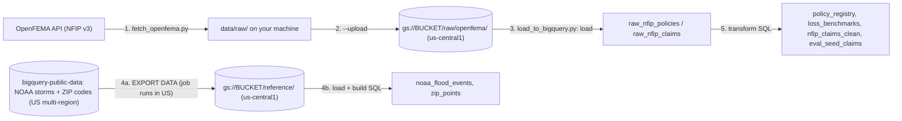

# Loading the data (step by step, for GCP beginners)

This guide takes you from an empty Google Cloud project to a `claimdesk` BigQuery dataset **in `us-central1`** holding real FEMA flood-insurance data plus a small copy of NOAA storm events and ZIP code points, ready for the app. Every command is one you run yourself; nothing here runs automatically.

> [!NOTE]
> This product uses the FEMA OpenFEMA API, but is not endorsed by FEMA. NFIP data is **redacted by FEMA** for privacy (no names, no policy numbers, no street addresses, rounded coordinates). That is why ClaimDesk **generates** fictional policy numbers and names; see [data_dictionary.md](data_dictionary.md).

## What you will end up with



Everything you create (bucket, dataset, tables) lives in **`us-central1`**. The public NOAA/ZIP data is only *read* in the `US` multi-region by the export job; the app never queries `bigquery-public-data` at runtime.

| Table | Rows (default settings) | Used by |
| --- | --- | --- |
| `policy_registry` | ~200k real 2025+ residential policy terms | live `lookup_policy` tool |
| `loss_benchmarks` | 6 (CO, TX, FL, LA, NC, ALL) | risk rules ("unusually high/late") |
| `nfip_claims_clean` | ~460k real claims since 2015 | analysis, eval seeds |
| `eval_seed_claims` | ~200 | `evals/build_eval_cases.py` |
| `noaa_flood_events` | ~17k NOAA flood-type events since 2015 (5 states) | weather check (`weather_events.py`) |
| `zip_points` | ~4.9k ZIP codes (5 states) | weather check (`weather_events.py`) |
| `intake_packets`, `conversation_traces` | empty (the app fills them) | hand-off + evals |

**Time:** about 30–60 minutes the first time. **Cost:** typically $0 inside the free tier (see [Cost](#9-cost)).

---

## 0. Words you will see

| Term | Meaning |
| --- | --- |
| **Project** | Your container for everything in Google Cloud (billing, permissions). It has an ID like `my-claimdesk-123`. |
| **ADC** (Application Default Credentials) | How code on your machine proves who you are to Google. Created by `gcloud auth application-default login`. No API keys. |
| **Bucket** | A top-level folder in Cloud Storage (GCS). Its name is globally unique. |
| **Dataset** | A folder of tables in BigQuery. Its **location** is fixed forever when you create it. |
| **NDJSON** | "Newline-delimited JSON": one JSON object per line. BigQuery loads it natively. |
| **Region `us-central1`** | One Google data-center region (Iowa). **All** our resources live here. |
| **Multi-region `US`** | A BigQuery location that spans several US regions. The public NOAA/ZIP datasets live there; our data does not. |
| **EXPORT DATA** | A SQL statement that writes a query's result as files to Cloud Storage. |
| **Parquet** | A compact, typed, column-oriented file format. BigQuery exports and loads it natively. |

---

## 1. Prerequisites (one time)

1. **Install the Google Cloud CLI** (`gcloud`, `bq`, `gcloud storage`) from https://cloud.google.com/sdk/docs/install. On Cloud Shell it is already installed.
2. **Log in twice.** The first login is for the CLI; the second creates the ADC that Python uses:
   ```bash
   gcloud auth login
   gcloud auth application-default login
   ```
3. **Choose your project** (replace `my-claimdesk-123`):
   ```bash
   export GOOGLE_CLOUD_PROJECT=my-claimdesk-123
   gcloud config set project "$GOOGLE_CLOUD_PROJECT"
   # Bill ADC API calls to this project (avoids "quota project" errors):
   gcloud auth application-default set-quota-project "$GOOGLE_CLOUD_PROJECT"
   ```
   The project must have **billing enabled**. The free tier still applies, but BigQuery and GCS require a billing account.
4. **Turn on the two APIs** this guide uses:
   ```bash
   gcloud services enable bigquery.googleapis.com storage.googleapis.com
   ```
5. **Permissions.** If you are the project **Owner** you already have everything. Otherwise ask for:
   `roles/bigquery.user` (run jobs and create datasets), `roles/bigquery.dataEditor`, and `roles/storage.admin` (to create the bucket), or `roles/storage.objectAdmin` if someone else created it.
6. **Configure the app.** Copy `.env.example` to `.env` and set at least:
   ```bash
   GOOGLE_CLOUD_PROJECT=my-claimdesk-123
   CLAIMDESK_BQ_DATASET=claimdesk
   CLAIMDESK_REGION=us-central1
   CLAIMDESK_BQ_LOCATION=us-central1        # optional: defaults to CLAIMDESK_REGION
   CLAIMDESK_GCS_BUCKET=my-claimdesk-123-claimdesk-evidence
   CLAIMDESK_SUPPORTED_STATES=CO,TX,FL,LA,NC  # optional: this is the default
   ```
   `CLAIMDESK_SUPPORTED_STATES` drives both the FEMA download and the NOAA/ZIP copy.
   `claimdesk/settings.py` reads `.env` automatically. Real environment variables win over the file.

## 2. Install the Python dependencies

From the project root:

```bash
uv sync --extra data --extra dev
```

The `data` extra adds `requests`. `google-cloud-bigquery` and `google-cloud-storage` are already runtime dependencies.

## 3. Why everything is in `us-central1`, and how we still use NOAA data

**The rule:** every resource of this project (Cloud Run, Cloud Storage, Firestore **and BigQuery**) lives in `us-central1`. One region means simple permissions, predictable latency and no cross-region data transfer.

**The catch:** the app's weather check needs two BigQuery *public* datasets, `bigquery-public-data.noaa_historic_severe_storms` (storm events) and `bigquery-public-data.geo_us_boundaries.zip_codes` (ZIP code points). Both live in the **`US` multi-region**. A BigQuery query can only read tables that are all in **the same location**, so a query in our `us-central1` dataset cannot join them. It fails with *"Not found: Dataset … was not found in location us-central1"*.

**The fix: copy the small part we need.** The `reference` step of `load_to_bigquery.py` does this in three moves:

| Move | Runs in | What happens |
| --- | --- | --- |
| a. `EXPORT DATA` ([sql/reference/01_…](../data_pipeline/sql/reference/01_export_noaa_flood_events.sql), [02_…](../data_pipeline/sql/reference/02_export_zip_points.sql)) | job location **`US`** | Reads the public tables, keeps only flood-type events and ZIPs in your supported states, and writes Parquet files to `gs://BUCKET/reference/<table>/run=<timestamp>/` (your `us-central1` bucket). |
| b. Load job | **`us-central1`** | Loads those files into staging tables `stg_noaa_flood_events`, `stg_zip_points`. |
| c. Build SQL ([03_…](../data_pipeline/sql/reference/03_build_reference_tables.sql)) | **`us-central1`** | Creates `noaa_flood_events` and `zip_points` (with GEOGRAPHY points) and drops the staging tables. |

**Why this is allowed and free of transfer fees** (from the BigQuery docs on [locations](https://cloud.google.com/bigquery/docs/locations#location-considerations) and [exporting data](https://cloud.google.com/bigquery/docs/exporting-data)):
- An export or query job must run in the location of the data it **reads** (`US` for the public tables). Where it may **write** files is a separate question: the destination is just a Cloud Storage bucket.
- For a `US` multi-region dataset, BigQuery treats a bucket in the **`us-central1`** single region (or a dual-region that includes `us-central1`) as **colocated**. Other US regions, such as `us-west1`, would incur data-transfer charges. Our bucket is in `us-central1`, so the export is colocated.
- Loading files from a `us-central1` bucket into a `us-central1` dataset is colocated too.
- **Nothing is stored in `US`.** The export job only reads public data there; the result goes straight to your bucket.

**Things to know:**
- The copy is a **snapshot**. NOAA publishes events with a lag of a few months (at the time of writing, the 2026 table runs to the end of May), and our copy only changes when you [refresh it](#10b-refresh-reference-data).
- The public NOAA tables have quirks that the export fixes. `state` is truncated to 2 letters, so states are matched by FIPS number. `event_type` is lowercase, so it is mapped back to names like `Flash Flood`. Each event has one row per corner of its warning polygon, so we keep one row per event with the centre point.
- A dataset's location **cannot be changed later**. If you created `claimdesk` in `US` with an older version of this guide, delete it and start again ([step 11](#11-deleting-everything)).

## 4. Create the bucket (one time)

If you already ran `deploy/03_storage_firestore_bigquery.sh`, the bucket exists; skip to step 5.

```bash
gcloud storage buckets create "gs://$CLAIMDESK_GCS_BUCKET" \
  --location=us-central1 \
  --uniform-bucket-level-access \
  --public-access-prevention
```

- `--uniform-bucket-level-access`: permissions are managed only with IAM, never per-file ACLs (simpler and safer).
- `--public-access-prevention`: nobody can ever make an object public, even by mistake.

Check it:

```bash
gcloud storage buckets describe "gs://$CLAIMDESK_GCS_BUCKET" --format="value(location,iamConfiguration.publicAccessPrevention)"
# US-CENTRAL1   enforced
```

## 5. Download the FEMA data

1. **Look before you download.** This sends tiny count-only requests and saves nothing:
   ```bash
   uv run --no-sync python -m data_pipeline.fetch_openfema --counts-only
   ```
   Expected output (numbers grow over time):
   ```text
   NfipPolicies  CO  policyEffectiveDate >= 2025-01-01:     23,586 rows
   NfipPolicies  TX  policyEffectiveDate >= 2025-01-01:    988,180 rows  (will sample 50,000)
   NfipPolicies  FL  policyEffectiveDate >= 2025-01-01:  1,966,465 rows  (will sample 50,000)
   ...
   NfipClaims    FL  dateOfLoss >= 2015-01-01:           201,475 rows
   ```
2. **Smoke test** with 2 states, 1,000 policies and 1,000 claims each (usually a few minutes; FEMA's API speed varies a lot):
   ```bash
   uv run --no-sync python -m data_pipeline.fetch_openfema --states CO,NC --max-per-state 1000 --max-claims-per-state 1000 --gzip
   ```
   The real download below uses different caps, so it re-plans these two states and replaces the smoke-test files automatically.
3. **The real download**, gzip-compressed and uploaded to your bucket as it goes:
   ```bash
   uv run --no-sync python -m data_pipeline.fetch_openfema --gzip --upload
   ```

What happens:
- Files land in `data/raw/openfema/<nfip_policies|nfip_claims>/state=XX/part-00000.jsonl.gz`. The `data/` folder is git-ignored.
- **Policies** are capped by `--max-per-state` (default 50,000). Whole pages are taken *evenly spread* across all matching rows, so the sample covers every month from 2025 onward rather than just January. Use `--max-per-state 0` for everything (~3.9M rows; slow).
- **Claims** since 2015 are all downloaded (~460k rows).
- `--upload` copies each finished file to `gs://$CLAIMDESK_GCS_BUCKET/raw/openfema/...`. Files whose MD5 checksum already matches the bucket copy are skipped. After each state is uploaded, **older `part-*` files in that state's bucket folder that are not part of this download are deleted**, because the loader reads every part file in the folder (otherwise a smaller re-download, or switching `--gzip` on/off, would mix old rows in). Add `--keep-stale-parts` to turn that off.
- **Interrupted?** Run the same command again. Finished pages and already-uploaded files are skipped. `--force` starts from scratch. Changing the plan (dates, caps, `--page-size`, `--gzip`) also re-plans the affected states.
- Useful flags: `--states`, `--policies-since`, `--claims-since`, `--dataset policies|claims`, `--help`.

<details>
<summary>Uploading files you downloaded earlier without <code>--upload</code></summary>

Re-run the same fetch command with `--upload`; it only uploads, since downloads are already complete. Or use `gcloud` directly, excluding the bookkeeping files:

```bash
gcloud storage rsync -r data/raw/openfema "gs://$CLAIMDESK_GCS_BUCKET/raw/openfema" \
  --exclude='.*_(manifest|SUCCESS)\.json$'
```
</details>

Check the bucket:

```bash
gcloud storage ls -r "gs://$CLAIMDESK_GCS_BUCKET/raw/openfema/" | head
gcloud storage du -s -r "gs://$CLAIMDESK_GCS_BUCKET/raw/openfema/"
```

## 6. Load into BigQuery (Python path, recommended)

1. **Dry run first.** It prints every SQL statement and load job and asks BigQuery to validate them. Nothing is created, and it costs nothing:
   ```bash
   uv run --no-sync python -m data_pipeline.load_to_bigquery --dry-run
   ```
   On a brand-new project some files say *"could not validate … Not found: Dataset"*. That is expected, because step 1 has not created the dataset yet.
2. **Run all four steps** (`create`, `load`, `reference`, `transform`):
   ```bash
   uv run --no-sync python -m data_pipeline.load_to_bigquery
   ```
   Output looks like:
   ```text
   == Step 1/4: create dataset my-claimdesk-123.claimdesk (location us-central1) and app tables ==
     [done] 00_create_dataset_and_tables.sql: billed 0.0 MB (job ..., location us-central1)
   == Step 2/4: load raw NDJSON from Cloud Storage into staging tables ==
     [done] my-claimdesk-123.claimdesk.raw_nfip_policies: 223,586 rows from 23 file(s) ...
     [done] my-claimdesk-123.claimdesk.raw_nfip_claims: 459,858 rows from 48 file(s) ...
   == Step 3/4: copy NOAA + ZIP reference data into my-claimdesk-123.claimdesk (run 20260924T101500Z) ==
     NOAA years: 2015-2026 (12 yearly tables); states: CO, TX, FL, LA, NC
     [done] 01_export_noaa_flood_events.sql: billed ~104 MB (job ..., location US)
     [done] 02_export_zip_points.sql: billed ~10 MB (job ..., location US)
     [done] my-claimdesk-123.claimdesk.stg_noaa_flood_events: ~17,000 rows from gs://.../reference/noaa_flood_events/run=.../*.parquet
     [done] my-claimdesk-123.claimdesk.stg_zip_points: ~4,900 rows from gs://.../reference/zip_points/run=.../*.parquet
     [done] 03_build_reference_tables.sql: billed ... MB (job ..., location us-central1)
   == Step 4/4: build app tables with SQL ==
     [done] 10_policy_registry.sql: billed ... MB
     [done] 20_loss_benchmarks.sql: billed ... MB
     [done] 30_claims_reference.sql: billed ... MB
     [done] 40_eval_seed_claims.sql: billed ... MB
   ```
   Row and file counts depend on the day you download (FEMA keeps adding records). With the default caps, each state that has more than 50,000 policies gives 5 policy files of 10,000 rows, and a smaller state gives one file per 10,000 rows (CO above: 23,586 rows = 3 files, so 4 × 5 + 3 = 23 files).
3. **Re-run only part of it** later:
   ```bash
   uv run --no-sync python -m data_pipeline.load_to_bigquery --steps transform
   uv run --no-sync python -m data_pipeline.load_to_bigquery --steps transform --only 10_policy_registry
   uv run --no-sync python -m data_pipeline.load_to_bigquery --steps reference   # NOAA/ZIP copy only
   ```

Each step is safe to repeat. `00` uses `IF NOT EXISTS`, loads use `WRITE_TRUNCATE` (replace), and transforms use `CREATE OR REPLACE TABLE`. Each `reference` run writes to a new `run=<timestamp>/` folder and loads only that folder, so old export files are never mixed in.

> [!NOTE]
> The `reference` step needs write access to the bucket (`roles/storage.objectAdmin`, or Owner), because the export job writes files there as **you**.

## 7. Alternative: the same thing with only the `bq` CLI

This is useful if you want to see exactly what the Python script does. Note the `--location` on every command: `us-central1` for everything, except the two export jobs, which use `US`.

```bash
DS=claimdesk
LOC=us-central1
render() {  # replace the {project}/{dataset}/{location} placeholders in a SQL file
  sed -e "s/{project}/$GOOGLE_CLOUD_PROJECT/g" -e "s/{dataset}/$DS/g" -e "s/{location}/$LOC/g" "$1"
}

# 7a. Dataset in us-central1 (or just run the 00 SQL file in 7b, which also creates it)
bq --location=us-central1 mk --dataset \
  --description "ClaimDesk flood-claim demo (FEMA NFIP data; generated identities)" \
  "$GOOGLE_CLOUD_PROJECT:$DS"

# 7b. App tables (intake_packets, conversation_traces)
render data_pipeline/sql/00_create_dataset_and_tables.sql | bq query --location=$LOC --use_legacy_sql=false

# 7c. Staging tables from GCS, with the explicit schemas
bq --location=$LOC load --source_format=NEWLINE_DELIMITED_JSON --replace --ignore_unknown_values \
  "$DS.raw_nfip_policies" "gs://$CLAIMDESK_GCS_BUCKET/raw/openfema/nfip_policies/*" \
  data_pipeline/schemas/raw_nfip_policies.json
bq --location=$LOC load --source_format=NEWLINE_DELIMITED_JSON --replace --ignore_unknown_values \
  "$DS.raw_nfip_claims" "gs://$CLAIMDESK_GCS_BUCKET/raw/openfema/nfip_claims/*" \
  data_pipeline/schemas/raw_nfip_claims.json

# 7d. Reference data (NOAA + ZIP). The export files have more placeholders
#     (bucket, run folder, states, the list of yearly NOAA tables), so let
#     the Python helper render them to /tmp:
RUN_ID=$(date -u +%Y%m%dT%H%M%SZ)
RUN_ID=$RUN_ID uv run --no-sync python - <<'EOF'
import os
from datetime import date
from claimdesk.settings import get_settings
from data_pipeline import load_to_bigquery as L
s = get_settings()
years = L.noaa_years(L.NOAA_FIRST_YEAR, None, this_year=date.today().year)
for ref in L.REFERENCE_TABLES:
    sql = L.render_reference_export(ref, project=s.project_id, dataset=s.bq_dataset, location=s.bq_location,
                                    bucket=s.gcs_bucket, run_id=os.environ["RUN_ID"],
                                    states=s.supported_states, years=years)
    open(f"/tmp/{ref.export_sql}", "w").write(sql)
    print("wrote", f"/tmp/{ref.export_sql}")
EOF
bq query --location=US --use_legacy_sql=false < /tmp/01_export_noaa_flood_events.sql   # runs in US, writes to your bucket
bq query --location=US --use_legacy_sql=false < /tmp/02_export_zip_points.sql
bq --location=$LOC load --source_format=PARQUET --replace \
  "$DS.stg_noaa_flood_events" "gs://$CLAIMDESK_GCS_BUCKET/reference/noaa_flood_events/run=$RUN_ID/*.parquet" \
  data_pipeline/schemas/stg_noaa_flood_events.json
bq --location=$LOC load --source_format=PARQUET --replace \
  "$DS.stg_zip_points" "gs://$CLAIMDESK_GCS_BUCKET/reference/zip_points/run=$RUN_ID/*.parquet" \
  data_pipeline/schemas/stg_zip_points.json
render data_pipeline/sql/reference/03_build_reference_tables.sql | bq query --location=$LOC --use_legacy_sql=false

# 7e. Transforms, in order
for f in data_pipeline/sql/10_*.sql data_pipeline/sql/20_*.sql data_pipeline/sql/30_*.sql data_pipeline/sql/40_*.sql; do
  echo "== $f"; render "$f" | bq query --location=$LOC --use_legacy_sql=false
done
```

> [!NOTE]
> In 7d the helper assumes a NOAA table exists for every year up to the current one. Early in January, before NOAA publishes `storms_<new year>`, the export fails with *"Not found: Table … storms_20XX"*. The Python loader avoids this by listing the tables that actually exist.

> [!WARNING]
> The `*` wildcard in 7c matches **every** object under the folder. If you uploaded with `gcloud storage cp -r` (which also copies `_manifest.json` and `_SUCCESS.json`), the load fails. Upload with `--upload` or the `rsync --exclude` command above. The Python loader lists and loads only `part-*` files, so it does not have this problem.

## 8. Verify

Run these in the BigQuery console (https://console.cloud.google.com/bigquery) or with `bq query --location=us-central1 --use_legacy_sql=false '...'`. Replace `my-claimdesk-123` with your project ID.

**Row counts:**

```sql
SELECT 'raw_nfip_policies' AS t, COUNT(*) AS n FROM `my-claimdesk-123.claimdesk.raw_nfip_policies`
UNION ALL SELECT 'raw_nfip_claims', COUNT(*) FROM `my-claimdesk-123.claimdesk.raw_nfip_claims`
UNION ALL SELECT 'policy_registry', COUNT(*) FROM `my-claimdesk-123.claimdesk.policy_registry`
UNION ALL SELECT 'loss_benchmarks', COUNT(*) FROM `my-claimdesk-123.claimdesk.loss_benchmarks`
UNION ALL SELECT 'nfip_claims_clean', COUNT(*) FROM `my-claimdesk-123.claimdesk.nfip_claims_clean`
UNION ALL SELECT 'eval_seed_claims', COUNT(*) FROM `my-claimdesk-123.claimdesk.eval_seed_claims`
UNION ALL SELECT 'noaa_flood_events', COUNT(*) FROM `my-claimdesk-123.claimdesk.noaa_flood_events`
UNION ALL SELECT 'zip_points', COUNT(*) FROM `my-claimdesk-123.claimdesk.zip_points`;
```

**Five demo policies** (put them in the README):

```sql
SELECT policy_number, policyholder_name, status, property_state, reported_city, reported_zip_code,
       effective_start, effective_end, building_coverage_usd, building_deductible_usd
FROM `my-claimdesk-123.claimdesk.policy_registry`
WHERE status = 'active' AND reported_city != ''
ORDER BY property_state, policy_number
LIMIT 5;
```

**The exact lookup the app runs** (parameterized, as in `policy_registry.py`). Paste one of the numbers from above, typed the way a caller might say it:

```bash
bq query --location=us-central1 --use_legacy_sql=false --parameter='policy_key:STRING:FLDTX7Q2K9M' \
'SELECT policy_number, policyholder_name, status FROM `my-claimdesk-123.claimdesk.policy_registry`
 WHERE policy_number_key = @policy_key LIMIT 1'
```

`policy_number_key` is the number uppercased with spaces and dashes removed (`fld-tx 7q2k9m` → `FLDTX7Q2K9M`).

**Generated numbers are unique** (should return no rows):

```sql
SELECT policy_number_key, COUNT(*) FROM `my-claimdesk-123.claimdesk.policy_registry`
GROUP BY 1 HAVING COUNT(*) > 1;
```

**Benchmarks look sane** (p50 < p90 < p95, lags of days to weeks):

```sql
SELECT * FROM `my-claimdesk-123.claimdesk.loss_benchmarks` ORDER BY state;
```

**Eval seeds are balanced:**

```sql
SELECT state, cause_group, claim_outcome, match_level, COUNT(*) AS n
FROM `my-claimdesk-123.claimdesk.eval_seed_claims`
GROUP BY 1, 2, 3, 4 ORDER BY 1, 2, 3, 4;
```

**The dataset really is in `us-central1`:**

```bash
bq show --format=prettyjson "$GOOGLE_CLOUD_PROJECT:claimdesk" | grep '"location"'
#   "location": "us-central1",
```

**The reference copy looks right** (every state present, freshest event a few months old):

```sql
SELECT state_code, COUNT(*) AS events, MIN(event_date) AS first_day, MAX(event_date) AS last_day,
       COUNTIF(event_point IS NULL) AS without_point, ANY_VALUE(refreshed_at) AS refreshed_at
FROM `my-claimdesk-123.claimdesk.noaa_flood_events`
GROUP BY state_code ORDER BY state_code;
```

**The weather check's own query** (the same SQL as `claimdesk/data_access/weather_events.py`) for Wilmington, NC, around the coastal storm of 16 September 2024 ("Potential Tropical Cyclone Eight"):

```bash
bq query --location=us-central1 --use_legacy_sql=false \
  --parameter='zip:STRING:28401' --parameter='date_from:DATE:2024-09-13' --parameter='date_to:DATE:2024-09-19' \
  --parameter='radius_m:FLOAT64:50000' --parameter='event_types:ARRAY<STRING>:["Flash Flood","Flood","Heavy Rain"]' \
'WITH zip AS (SELECT point AS pt, county_name_normalized, state_code
             FROM `my-claimdesk-123.claimdesk.zip_points` WHERE zip_code = @zip LIMIT 1)
 SELECT s.event_type, s.cz_name, s.event_date,
        IF(s.event_point IS NULL, NULL, ST_DISTANCE(s.event_point, zip.pt) / 1000) AS distance_km
 FROM `my-claimdesk-123.claimdesk.noaa_flood_events` AS s, zip
 WHERE s.event_date BETWEEN @date_from AND @date_to AND s.event_type IN UNNEST(@event_types)
   AND ((s.event_point IS NOT NULL AND ST_DWITHIN(s.event_point, zip.pt, @radius_m))
     OR (s.cz_type = "C" AND s.state_code = zip.state_code AND s.cz_name_normalized = zip.county_name_normalized))'
```

You should see several `Flash Flood` rows for `NEW HANOVER` county.

## 9. Cost

Prices change, so check https://cloud.google.com/bigquery/pricing and https://cloud.google.com/storage/pricing. As of writing:

| Item | Size with defaults | Price | Free tier |
| --- | --- | --- | --- |
| GCS storage (`raw/openfema/` gzip + `reference/` Parquet) | ~60–100 MB + ~1 MB per reference run | ~\$0.02 / GB-month (Standard, us-central1) | 5 GB-months in some US regions (Always Free) |
| BigQuery storage (raw + built tables) | ~0.5–1 GB logical | ~\$0.02 / GB-month (active logical) | **first 10 GiB per month free** |
| BigQuery load jobs | — | **free** (shared slot pool) | — |
| BigQuery queries (transforms) | each scans < 1 GB | \$6.25 / TiB on-demand | **first 1 TiB per month free** |
| Reference export (`EXPORT DATA`, per refresh) | ~104 MB (NOAA, 12 yearly tables) + ~2–10 MB (ZIP) scanned | same on-demand query price (≈ \$0.0007) | covered by the 1 TiB |
| Export → bucket → dataset data transfer | ~2 MB | **\$0**: `US` → `us-central1` bucket and `us-central1` bucket → `us-central1` dataset are colocated | — |
| App lookups | a few KB–MB each | — | covered by the 1 TiB |
| OpenFEMA API | — | free | — |

So a normal load stays **inside the free tier**. Two safety nets are built in:
- `load_to_bigquery.py` sets `maximum_bytes_billed` (default 20 GB, `--max-gb`) on every transform query. BigQuery refuses to run anything bigger.
- The app's own queries use a 1 GiB `maximum_bytes_billed` (`claimdesk/data_access/bq_client.py`). The weather check reads only 1–2 monthly partitions of `noaa_flood_events` (kilobytes).

Loading **all** 3.9M policies (`--max-per-state 0`) is still only a few GB, well within the free tier, but downloading from FEMA takes much longer.

## 10. Refreshing the data

FEMA refreshes NFIP data regularly (see the `asOfDate` column). To refresh:

```bash
uv run --no-sync python -m data_pipeline.fetch_openfema --gzip --upload --force
uv run --no-sync python -m data_pipeline.load_to_bigquery --steps load,transform
```

> [!NOTE]
> `policy_registry.status` (`active`/`pending`/`expired`/`cancelled`; `pending` = the term starts in the future) is a **snapshot** computed on the day the SQL ran (column `status_as_of`). To update statuses without downloading anything:
> `uv run --no-sync python -m data_pipeline.load_to_bigquery --steps transform --only 10_policy_registry`
> Generated policy numbers and names do **not** change on a rebuild, because they depend only on the FEMA record `id`.

> [!WARNING]
> A **re-download** (`fetch_openfema --force`) can change *which* policies are in the registry. Policies are a systematic sample of pages spread across all matching rows, and FEMA's row count grows over time, so the sampled pages (and therefore the FEMA `id`s and their generated policy numbers) shift. A policy number you used in a demo, a blog post or an eval case may then return "not found". **Pin your demo policies:** note the policy numbers you show, and check them after every refresh:
> ```sql
> SELECT policy_number, status, property_state FROM `claimdesk.policy_registry`
> WHERE policy_number IN ('<your demo numbers>')
> ```
> (or keep the old `data/raw/` files and do not use `--force`). `eval_seed_claims` is rebuilt from the new registry too, so regenerate eval cases after a refresh.

### 10b. Refresh reference data

`noaa_flood_events` and `zip_points` are copies, so they do not update themselves. Refresh them when NOAA has published newer months (NOAA runs a few months behind), when you change `CLAIMDESK_SUPPORTED_STATES`, or at least once a quarter:

```bash
# 1. Look first (prints the export SQL; validates it with a free dry run):
uv run --no-sync python -m data_pipeline.load_to_bigquery --steps reference --dry-run
# 2. Refresh (about 1 minute; scans ~110 MB, which is inside the free tier):
uv run --no-sync python -m data_pipeline.load_to_bigquery --steps reference
# Optional: copy fewer years (e.g. only 2020 onward)
uv run --no-sync python -m data_pipeline.load_to_bigquery --steps reference --noaa-from-year 2020
```

- The app keeps working during a refresh: `CREATE OR REPLACE TABLE` swaps the new table in atomically.
- The column `refreshed_at` shows when each table was last rebuilt.
- Old export folders stay in the bucket (they are tiny). To clean them up, keep only the newest `run=` folder:
  ```bash
  gcloud storage ls "gs://$CLAIMDESK_GCS_BUCKET/reference/noaa_flood_events/"
  gcloud storage rm -r "gs://$CLAIMDESK_GCS_BUCKET/reference/noaa_flood_events/run=20260101T000000Z/"
  ```
- The app caches weather answers in memory per container, so restart or redeploy Cloud Run if you want refreshed data to show up immediately.

## 11. Deleting everything

> [!CAUTION]
> These commands permanently delete data. The dataset also holds the app's `intake_packets` and `conversation_traces`.

```bash
# Only the staging tables (the app keeps working):
bq rm -f -t "$GOOGLE_CLOUD_PROJECT:claimdesk.raw_nfip_policies"
bq rm -f -t "$GOOGLE_CLOUD_PROJECT:claimdesk.raw_nfip_claims"

# The raw files and reference exports in the bucket (the bucket itself stays; the app uses it for photos):
gcloud storage rm -r "gs://$CLAIMDESK_GCS_BUCKET/raw/openfema/"
gcloud storage rm -r "gs://$CLAIMDESK_GCS_BUCKET/reference/"

# The WHOLE dataset, all tables (-r = recursive, -f = no prompt):
bq rm -r -f -d "$GOOGLE_CLOUD_PROJECT:claimdesk"

# Local copies:
rm -rf data/raw/openfema
```

## 12. Troubleshooting

| Symptom | Fix |
| --- | --- |
| `Could not automatically determine credentials` | Run `gcloud auth application-default login`. |
| `403 … Project X has been deleted` or quota-project errors | `gcloud auth application-default set-quota-project "$GOOGLE_CLOUD_PROJECT"` |
| `Access Denied: … bigquery.jobs.create` | You need `roles/bigquery.user` (or Owner) on **this** project. Check `gcloud config get-value project`. |
| `Not found: Dataset … was not found in location …` | The command's `--location` does not match the dataset. Use `--location=us-central1` for everything **except** the two export jobs (`--location=US`). If `bq show` says your dataset is in `US` (an older setup), delete and recreate it (step 11, then step 6). |
| `Cannot read and write in different locations` | A query mixed our `us-central1` tables with `bigquery-public-data` (US). Only the export files in `sql/reference/` may read public data. |
| `EXPORT DATA statement cannot reference meta tables` | The export used the `storms_*` wildcard. Use the files in `sql/reference/` (they list each yearly table). |
| `Access Denied: … storage.objects.create` during the reference step | The export writes files as **you**. You need `roles/storage.objectAdmin` on the bucket. |
| `Weather records unavailable` in the app, `Not found: Table … zip_points` in logs | The reference step has not run in this project yet: `load_to_bigquery --steps reference`. |
| Fetch prints `Read timed out` / retries | OpenFEMA is slow or busy. The script retries with back-off; if it gives up, run the same command again and it resumes. Avoid `--order-by-id` on policies. |
| Load error `JSON parsing error … _manifest.json` | Bookkeeping files were uploaded next to the data. Use the Python loader, or delete `gs://…/raw/openfema/**/_*.json`. |
| `Query exceeded limit for bytes billed` | A transform needed more than `--max-gb`. Raise it only if you loaded far more data than the defaults. |
