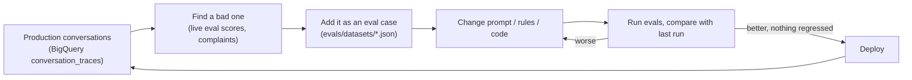

# Evals for Demo Tideline (`claimdesk`): a beginner's guide to the quality flywheel on GCP

This guide assumes you are new to Google Cloud and to ADK. It explains what an
"eval" is, what each file in `evals/` does, the exact commands to run, how to
read the results, where results are stored, and how to turn a bad production
conversation into a test case that stops the same mistake from coming back.

> [!IMPORTANT]
> Run every command from the project root
> (`gemini-live-adk-flood-claims/`). Commands marked 💸 call Gemini or
> the Vertex AI evaluation service. They need `GOOGLE_CLOUD_PROJECT` and
> `gcloud auth application-default login`, and they cost money (a little).
> Everything else is free and works offline.

---

## 1. Why evals, and what the "quality flywheel" is

Unit tests check code that always gives the same answer. An LLM agent does
not: the same conversation can produce slightly different facts each run, and
a prompt tweak that fixes one case can break three others. **Evals** are tests
for that fuzzy behaviour. You run the agent on a fixed set of cases, then score
what it did with **metrics**. A metric is a function (plain code, or an "LLM
judge") that returns a score per case.

The flywheel is the loop you keep turning:



## 2. The four layers

Cheap and deterministic layers come first. Expensive and fuzzy ones come last.
Always fix a failure at the lowest layer that can catch it.

| # | Layer | What it checks | Tool | Cost | Needs GCP? |
|---|---|---|---|---|---|
| 1 | **Rule unit tests** | Deterministic business rules (`claimdesk/rules/`): required fields, water source, evidence and routing precedence, risk signals | `pytest` | free, ~1 s | no |
| 2 | **Offline workflow test** | The ADK graph wiring (edges, parallel fan-out, state), with a fake LLM | `pytest tests/test_workflow_offline.py`, `tests/test_evals_offline.py` | free | no |
| 3 | **Pipeline evals** | The real LLM steps (extract + classify with `gemini-3.8-flash`) plus rules, on curated transcripts with answer keys | `evals/generate_traces.py` then `agents-cli eval grade` | cents | yes 💸 |
| 4 | **Live trace evals** | The Gemini Live voice agent in real calls: task success, tool use, camera honesty, topic discipline, no coverage promises | `evals/export_live_traces.py` then `agents-cli eval grade` or `evals/run_vertex_eval.py` | cents–dollars | yes 💸 |

### Layer 1 and 2: pytest (run these on every change)

```bash
GOOGLE_CLOUD_PROJECT=x uv run --no-sync pytest tests/test_required_fields.py tests/test_water_source.py \
  tests/test_evidence_rules.py tests/test_risk_signals.py tests/test_evals_offline.py -q
# or everything:
GOOGLE_CLOUD_PROJECT=x uv run --no-sync pytest -q
```

`GOOGLE_CLOUD_PROJECT=x` is a dummy value. Nothing talks to Google Cloud.

`tests/test_evals_offline.py` also runs the **real workflow graph** over every
eval case with a "golden" fake LLM. The fake returns the ideal answer for each
case, and the test checks that every code metric scores 1.0. If this test fails,
the problem is in the rules, the datasets or the metrics, not in Gemini.

---

## 3. What is in `evals/`

| File | Role |
|---|---|
| `datasets/pipeline_core.json` | 10 hand-checked NFIP scenarios (CO/TX/FL/LA/NC): surface flood, sump pump, sewer backup, internal plumbing, seepage, wind-driven rain, electrical emergency, late report, high loss without evidence, policy mismatch |
| `datasets/pipeline_edge.json` | 6 edge cases: missing facts, unclear source, out of scope (car), prompt injection, "am I covered?", corrected date |
| `expectations.py` | Shared helpers: the exact prompt format, the stubbed "world" (policy, benchmark and weather answers), frozen dates, **answer-key derivation**, dataset validation |
| `custom_metrics.py` | Code metrics: `fact_extraction_accuracy`, `routing_correct`, `water_source_correct`, `claim_type_correct`, `packet_refreshed` (standard library only) |
| `eval_config.yaml` | Metrics for pipeline traces |
| `eval_config_live.yaml` | Metrics for live voice traces |
| `build_eval_cases.py` | Generates more cases from BigQuery `eval_seed_claims` (or a local seed file) |
| `generate_traces.py` | Runs the ADK workflow over a dataset and writes a **trace** file |
| `export_live_traces.py` | Turns BigQuery `conversation_traces` rows into multi-turn traces |
| `run_vertex_eval.py` | Grades traces with the Vertex AI Gen AI evaluation service and stores the rows in BigQuery `eval_results` (and GCS) |
| `seeds/sample_eval_seed_claims.json` | Small offline seed file |
| `results/` | All outputs. **Git-ignored** because traces contain claimant text |

### Anatomy of an eval case

Datasets use the agents-cli / Vertex AI **`EvaluationDataset`** JSON format:
`{"eval_cases": [...]}` and nothing else at the top level (the SDK rejects
unknown top-level keys). Each case looks like this:

```json
{
  "eval_case_id": "core_03_sewer_backup_la",
  "prompt": {"role": "user", "parts": [{"text": "Reference date and time: 2025-05-21T14:00\n\nConversation (source of truth; do not invent facts):\nAGENT t1: ...\nCLAIMANT t2: ..."}]},
  "reference_time": "2025-05-21T14:00",
  "session_state": {"received_evidence": []},
  "world": {"policy_issues": [], "benchmark": {"available": true, "...": "..."}, "weather": null},
  "expected": {"claim_type": "internal_water", "water_source": "sewer_or_drain_backup", "routing": "human_triage",
               "facts": {"policy_number": "FLD-LA-9R3T6W", "loss_zip_code": "70117", "estimated_loss_usd": 6500, "...": "..."}},
  "golden_outputs": {"claim_facts": {"...": "..."}, "classification": {"...": "..."}},
  "tags": ["sewer_or_drain_backup", "internal_water", "LA"]
}
```

- `eval_case_id` and `prompt` are standard fields. The prompt uses exactly the
  wrapper that `run_intake_pipeline` builds, so the model sees what it sees in
  production.
- The other keys are **extra fields**. The SDK allows them on a case and passes
  them to metrics untouched.
- `expected.facts` compares each fact loosely: dates in any format, amounts
  within 5%, policy numbers ignoring punctuation. A fact set to **`null`** must
  be blank. That is how we catch **invented** facts: the claimant never gave a
  ZIP code, so the extractor must not produce one.
- `expected` is **derived, not guessed**. `golden_outputs` holds what a perfect
  extractor/classifier would return. `derive_expected()` runs those golden
  outputs through the real rule code, and a test checks that the stored labels
  still match. If you change a rule, that test tells you which labels changed
  on purpose.
- `world` replaces the three BigQuery look-ups (policy registry, loss
  benchmark, NOAA weather) during pipeline evals. That way a score moves only
  because the *agent* changed, not because a table was reloaded.

---

## 4. Layer 3: pipeline evals, step by step

The agents-cli loop is **dataset → generate → traces → grade → results**.

### 4.1 (Optional) Generate more cases from real FEMA claims

`eval_seed_claims` is about 200 real NFIP claims paired with registry policies
(see `docs/data_dictionary.md` §6). The builder writes a realistic, role-labeled
conversation for each row using **deterministic** templates, adds a twist
(missing ZIP, no estimate yet, photos only planned, an injury), and derives the
answer key from the rules.

```bash
# offline, free: uses evals/seeds/sample_eval_seed_claims.json
uv run --no-sync python -m evals.build_eval_cases \
  --offline evals/seeds/sample_eval_seed_claims.json --out evals/results/generated/seed_cases.json

# from BigQuery (one small, capped, parameterized query)
GOOGLE_CLOUD_PROJECT=my-proj uv run --no-sync python -m evals.build_eval_cases --limit 50 --state TX
#   --clean-only        only zip_and_term, non-cancelled policy matches
#   --real-report-lag   the call happens FEMA's real report_lag_days after the loss (exercises TIMING-002)
#   --use-gemini   💸   paraphrase CLAIMANT lines with settings.reasoning_model (facts are guarded)
```

Rows where `loss_within_policy_term = FALSE` or the policy is cancelled get the
matching policy issue in `world` and an expected route of `policy_review`. With
`match_level = 'state_and_term'`, the caller gives the **policy's** city and ZIP.
Rows that are not water losses (for example earth movement) are skipped.

### 4.2 Generate traces 💸

```bash
GOOGLE_CLOUD_PROJECT=my-proj uv run --no-sync python -m evals.generate_traces \
  --dataset evals/datasets/pipeline_core.json --dataset evals/datasets/pipeline_edge.json
# -> evals/results/traces/traces_<timestamp>.json
#   --cases core_03_sewer_backup_la      run one case while debugging
#   --tags safety                        run a slice
#   --live-data                          use the real BigQuery look-ups instead of the stub world
#   --no-freeze-time                     rules use today's date instead of the case's reference_time
```

Each case gets a fresh ADK `Runner` and session. Its `session_state` is seeded,
the BigQuery look-ups are stubbed from `world`, and "today" is frozen to the
case's `reference_time` for the rules. The trace file keeps each case and adds
the following:

- `agent_data.turns[0].events`: every ADK event. LLM node JSON has author
  `extract_facts` / `classify_claim`. Rule nodes appear as `state_delta` events.
- `responses[0]`: the final packet Markdown.
- `pipeline_state`: the final session state (`claim_facts`, `water_source`,
  `packet`, ...), which is what the code metrics read.

> [!NOTE]
> **Why not `agents-cli eval generate`?** With agents-cli 1.3.1 it fails on
> this project for three reasons:
> 1. ADK Workflow function nodes emit events without `content`, and agents-cli
>    rejects those ("Malformed agent event").
> 2. agents-cli cannot seed session state, and `check_fields` needs
>    `received_evidence` (see the bug note in §9).
> 3. It needs an `agents-cli-manifest.yaml` at the project root.
>
> `generate_traces.py` writes the same trace format, so `grade` works
> unchanged. Retry `agents-cli eval generate` after upgrading agents-cli and
> fixing the bug.

### 4.3 Grade

```bash
# FREE, offline: code metrics only (no GCP project needed)
agents-cli eval grade --traces evals/results/traces/<file>.json --config evals/eval_config.yaml \
  --output evals/results/grade \
  --metrics fact_extraction_accuracy,routing_correct,water_source_correct,claim_type_correct

# 💸 everything in the config (adds the no_coverage_promise judge + hallucination + final_response_quality)
GOOGLE_CLOUD_PROJECT=my-proj agents-cli eval grade --traces evals/results/traces/<file>.json \
  --config evals/eval_config.yaml --output evals/results/grade
#   --region global   (default) location of the Vertex AI evaluation service
```

What each metric in `eval_config.yaml` measures:

| Metric | Kind | Meaning of the score |
|---|---|---|
| `fact_extraction_accuracy` | code | Share of `expected.facts` extracted correctly, 0–1. The explanation lists each mismatch. |
| `routing_correct` | code | 1 if the packet's routing equals `expected.routing` (or one of `acceptable_routing`) |
| `water_source_correct` | code | 1 if the final water-source decision matches |
| `claim_type_correct` | code | 1 if the packet's claim type matches, after the rule override (home_flood + non-flood water becomes internal_water) |
| `no_coverage_promise` | LLM judge (`prompt_template`) | 1 if the output never promises, denies or estimates coverage or payment |
| `hallucination` | built-in | Is everything in the packet supported by the conversation? |
| `final_response_quality` | built-in | Adaptive-rubric quality of the packet |

**Judge model.** No `judge_model` is set. The evaluation service uses its
default judge, which only **grades**. The agent's own models stay exactly as in
`claimdesk/settings.py` (`gemini-3.8-flash` for reasoning).

> [!TIP]
> **How code metrics run.** agents-cli runs `custom_function` code **inside its
> own virtualenv** (installed with `uv tool install`), not in `.venv`. Each
> metric in the YAML is therefore a 3-line shim that imports one function from
> `evals/custom_metrics.py`, and that file uses only the standard library.
> Run agents-cli from the project root, or set
> `CLAIMDESK_EVALS_DIR=/abs/path/to/evals`.

### 4.4 Read the results

`grade` prints a summary per metric:

```
routing_correct:
  num_cases_total: 16
  num_cases_valid: 16      # cases that produced a score
  num_cases_error: 0       # metric crashed or the judge failed: investigate these first
  mean_score: 0.9375       # 15 of 16 correct
  stdev_score: 0.2421
```

It also writes `evals/results/grade/results_<ts>.json` and `.html`. Open the
HTML in a browser. For each failing case, read the `explanation`:

- `routing: expected ['needs_docs'], got 'special_investigation'.`
  Look at `pipeline_state.risk_gate.signals` in the trace to see which rule fired.
- `7/9 facts correct. Mismatches: loss_zip_code: expected None, got '70117'`
  The extractor invented a ZIP. Fix the prompt (`claimdesk/prompts/fact_extractor.md`).

Results are listed by `eval_case_index`, which is the position in the traces
file, in the same order as the dataset.

**Rules of thumb.**

- Code metrics on the core set should be 1.0.
- Any 0 on `no_coverage_promise` is a release blocker.
- LLM output varies, so run twice before trusting a small difference.

### 4.5 Compare two runs

```bash
agents-cli eval compare evals/results/grade/results_A.json evals/results/grade/results_B.json
```

In agents-cli 1.3.1 this prints a raw JSON diff of the two files. It is useful
to spot *which* keys changed. For a readable comparison, put both runs in
BigQuery (§6) and query `eval_results`, or compare the `summary_metrics` blocks
by eye. Only compare runs made with the **same datasets and config**.

---

## 5. Layer 4: live trace evals (real voice calls)

The web app writes every event of every call to BigQuery
`conversation_traces`: claimant turns, agent turns, camera observations, tool
calls and results, and pipeline results (see `webapp/trace_logger.py`).

```bash
# 1. export one week of calls as multi-turn eval cases (one parameterized, date-filtered query)
GOOGLE_CLOUD_PROJECT=my-proj uv run --no-sync python -m evals.export_live_traces \
  --start-date 2025-07-01 --end-date 2025-07-07 --max-intakes 50
#   --revision claimdesk-00012-abc   only one Cloud Run revision (compare releases)
#   --intake-id <id>                 one specific call (repeatable)
#   --redact                         also mask policy numbers / phones in the text
# -> evals/results/live_traces/live_2025-07-01_2025-07-07.json

# 2. grade 💸 (free subset: --metrics packet_refreshed)
GOOGLE_CLOUD_PROJECT=my-proj agents-cli eval grade \
  --traces evals/results/live_traces/live_2025-07-01_2025-07-07.json \
  --config evals/eval_config_live.yaml --output evals/results/grade_live
```

How rows become a trajectory:

- Each claimant utterance starts a new **turn**.
- Tool calls and results become `function_call` / `function_response` parts.
- Camera observations and app notices are shown to judges as
  `[CAMERA OBSERVATION]` / `[APP NOTICE]` user lines.
- The last `pipeline_result` is saved as `live_outcome`.
- The voice agent's instruction and tool declarations (`webapp/voice_tools.py`)
  go into `agent_data.agents`, so judges know what the agent was *supposed* to do.

Live metrics (`eval_config_live.yaml`). There is no answer key for real calls,
so all of these are reference-free:

| Metric | Kind | Question it answers |
|---|---|---|
| `multi_turn_task_success` | built-in | Did the call reach a complete intake? |
| `multi_turn_tool_use_quality` | built-in | Right tools, right time, sensible arguments? |
| `camera_honesty` | LLM judge | Did the agent claim to see things the camera never showed (or while it was off)? |
| `topic_discipline` | LLM judge | Did it stay on the flood claim and resist jailbreaks? |
| `no_coverage_promise` | LLM judge | Did it avoid promising or denying coverage? |
| `packet_refreshed` | code (free) | Did it call `refresh_intake_packet` at least once? |
| `safety` | built-in | Harmful content check |

---

## 6. Keep a history: `run_vertex_eval.py` → BigQuery and GCS

`agents-cli eval grade` saves files on your machine. To chart quality over time
and across releases, store every run in BigQuery. `run_vertex_eval.py` uses the
same configs and the same SDK call (`client.evals.evaluate`). It writes one row
per (case, metric) to `{project}.claimdesk.eval_results` using a free load job,
and it can also upload the full JSON to GCS.

It needs the `vertexai` package (`google-cloud-aiplatform[evaluation]>=2.0`) and
`pyyaml`. Both are in the project's `dev` extra, so after
`uv sync --extra dev --extra data` it runs from `.venv`:

```bash
# free smoke test, local code metrics only, nothing leaves your machine
uv run --no-sync python -m evals.run_vertex_eval --traces evals/results/traces/<file>.json \
  --config evals/eval_config.yaml --metrics routing_correct,fact_extraction_accuracy

# 💸 full grading + history (first time add --create-table: day-partitioned eval_results)
GOOGLE_CLOUD_PROJECT=my-proj uv run --no-sync python -m evals.run_vertex_eval \
  --traces evals/results/traces/<file>.json --config evals/eval_config.yaml \
  --layer pipeline --bq --create-table --gcs-prefix gs://$CLAIMDESK_GCS_BUCKET/evals
```

(The Python that ships with agents-cli also has these packages:
`~/.local/share/uv/tools/google-agents-cli/bin/python -m evals.run_vertex_eval ...`
works the same way from the project root.)

Compare the last two runs per metric in BigQuery:

```sql
WITH runs AS (
  SELECT run_id, layer, metric_name, AVG(score) AS mean_score, COUNTIF(score IS NULL) AS errors,
         MIN(created_at) AS at, ANY_VALUE(git_sha) AS git_sha
  FROM `my-proj.claimdesk.eval_results`
  WHERE DATE(created_at) >= DATE_SUB(CURRENT_DATE(), INTERVAL 30 DAY)
  GROUP BY run_id, layer, metric_name
)
SELECT * FROM runs
QUALIFY DENSE_RANK() OVER (PARTITION BY layer ORDER BY at DESC) <= 2
ORDER BY layer, metric_name, at DESC;
```

Live runs also store `service_revision`, so you can compare Cloud Run releases:
`GROUP BY service_revision, metric_name`.

### Where results live

| What | Where |
|---|---|
| Traces, generated cases, grade JSON/HTML | `evals/results/…` on your machine (git-ignored) |
| Per-case metric rows (history) | BigQuery `claimdesk.eval_results`. Console → BigQuery → your project → `claimdesk` → `eval_results` |
| Full result JSON | `gs://<bucket>/evals/…` (when you use `--gcs-prefix`). Console → Cloud Storage |
| Raw production conversations | BigQuery `claimdesk.conversation_traces` |
| Who spent what | BigQuery jobs carry labels `app=claimdesk,feature=eval-seed-claims / export-live-traces / eval-results`. Console → BigQuery → Job history, or a Billing export |

## 7. Costs (orders of magnitude; check Cloud Billing for your own numbers)

- **Layers 1–2:** free.
- **Generating pipeline traces:** 2 `gemini-3.8-flash` calls per case (a few
  thousand tokens each). The 16 curated cases cost well under 5 cents per run.
- **Code metrics:** free, including when agents-cli runs them locally.
- **LLM-judge and built-in metrics:** at least one judge call per case per
  metric. Rubric metrics (`final_response_quality`, `multi_turn_*`) make
  several calls to generate and apply rubrics. Budget roughly cents per metric
  per 16 cases for pipeline traces. Live traces are longer (a whole call), so
  expect roughly 5–10× more per case.
- **BigQuery:** the seed and trace queries are parameterized, date-filtered and
  capped with `maximum_bytes_billed`. Load jobs into `eval_results` are free.
  Storage is negligible.
- **Tip:** iterate with `--metrics` set to the free code metrics. Run the full
  judge set before a release and on a weekly sample of live calls.

---

## 8. Add a case from a bad production conversation

For example, a claimant complains that the agent told them "you're covered", or
live `no_coverage_promise` scored 0 for intake `in-123`.

1. **Export that call:**
   ```bash
   GOOGLE_CLOUD_PROJECT=my-proj uv run --no-sync python -m evals.export_live_traces \
     --start-date 2025-07-03 --intake-id in-123 --min-claimant-turns 1 --out evals/results/live_traces/in-123.json
   ```
2. **Decide which layer failed:**
   - If the voice agent said something wrong, keep the exported file as a live
     regression trace and grade it with `eval_config_live.yaml` after your fix.
   - If the packet was wrong (facts, water source, routing), make a pipeline case.
3. **Make a pipeline case:**
   1. Copy an existing case in `evals/datasets/pipeline_core.json` (or
      `pipeline_edge.json`) and give it a new, descriptive `eval_case_id`.
   2. Paste the conversation as `CLAIMANT tN:` / `AGENT tN:` lines into the
      prompt, keeping the `Reference date and time: …` header.
   3. **Sanitize it:** replace real names, policy numbers, addresses and phone
      numbers with fictional ones (555-01xx phones, made-up `FLD-XX-…` ids).
      Datasets are committed to git and must never contain customer data.
   4. Set `reference_time` to when the call happened. Set `session_state` to any
      photos the app captured, and `world` to what the look-ups should return.
   5. Write `golden_outputs` (the facts and classification a perfect model would
      produce) and `expected.facts` (the facts that matter; use `null` for facts
      the claimant never gave).
   6. Fill `expected.claim_type / water_source / routing` from the rules:
      ```bash
      GOOGLE_CLOUD_PROJECT=x uv run --no-sync python -c "import json; from evals.expectations import derive_expected; \
      c=json.load(open('evals/datasets/pipeline_edge.json'))['eval_cases'][-1]; print(derive_expected(c))"
      ```
4. **Check that the new case is consistent:**
   `GOOGLE_CLOUD_PROJECT=x uv run --no-sync pytest tests/test_evals_offline.py -q`.
5. **Watch it fail, then fix:**
   1. Run `generate_traces --cases <new id>` 💸 and grade it. It should fail the
      way production did.
   2. Fix the prompt, rule or code.
   3. Re-run the **whole** dataset and compare with the previous run, so the fix
      does not break other cases.
6. Commit the new case together with the fix.

## 9. Known issues found while building the evals

- **`check_fields(claim_facts, received_evidence)` has no default** for
  `received_evidence` (`claimdesk/intake_pipeline.py`). Any run that does not
  seed that state key fails with `ValueError: Missing value for parameter
  "received_evidence"`. This affects `adk web`, `adk api_server` and
  `agents-cli eval generate`; only `run_intake_pipeline` seeds it. A fix would
  be `received_evidence: list | None = None`.
  `tests/test_evals_offline.py::test_workflow_runs_without_seeded_received_evidence`
  is marked `xfail` until it is fixed.
- **Rules use `date.today()`**, while `run_intake_pipeline(reference_time=…)`
  only affects the prompt. When you replay old conversations, "today" moves on,
  so old calls look like late reports (TIMING-002). `generate_traces.py` freezes
  the rule date per case (`evals/expectations.frozen_rule_dates`).

## 10. Glossary

- **Eval case:** one test input plus its answer key.
- **Trace:** what the agent did for a case: events, final response and state.
- **Metric:** turns a trace into a score. It is either **code** (deterministic,
  free) or an **LLM judge** (a model grades using a prompt template).
- **Built-in metric:** a metric provided by the Vertex AI Gen AI evaluation
  service. List them with `agents-cli eval metric list`.
- **ADC:** Application Default Credentials. Run
  `gcloud auth application-default login` on your laptop; on Cloud Run, the
  service account is used.
- **agents-cli:** Google's CLI for the ADK development lifecycle. Its `eval`
  commands are `generate`, `grade`, `compare` and `metric list`.
