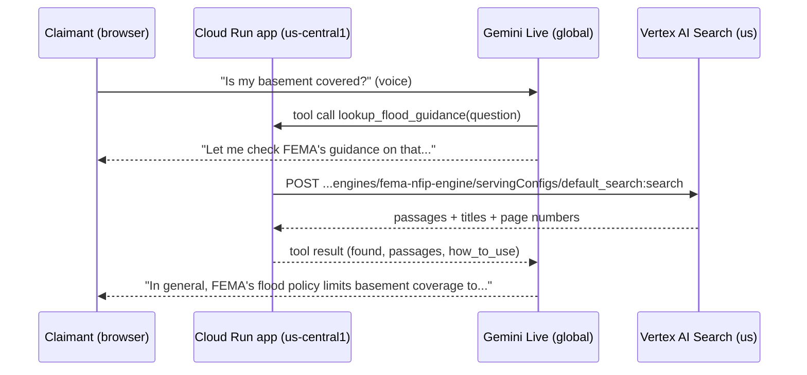

# Accuracy: the Agent Skill and Vertex AI Search grounding

This page explains the two features that make **Maya** (the *Demo Tideline* voice agent) and the claim pipeline more accurate, how to set them up, and how to measure what they add.

| Feature | What it adds | Where | Cost | Required? |
|---|---|---|---|---|
| **Agent Skill** `skills/nfip-flood-intake` | Built-in flood knowledge and worked examples in every prompt | Baked into the container | Slightly longer prompts, well under \$1/month for one user | On by default |
| **Vertex AI Search grounding** | Answers to general questions quoted from FEMA's own documents, with the page number | Vertex AI Search, **`us` multi-region** | About \$4 per 1,000 searches (Enterprise tier) | Optional; off until you set it up |

---

## 1. The Agent Skill (always on)

### What is an "Agent Skill"?
An Agent Skill is a folder with a `SKILL.md` file (a name, a description and instructions) plus optional `references/` files. Google ADK can read this format directly with `google.adk.skills.load_skill_from_dir()`. We keep domain knowledge there rather than in the prompts, so:
- the prompts stay short and about the *task*;
- a claims expert can review the knowledge without reading Python;
- evals can measure the effect of changing a single file.

### What's in it

| File | Contents | Used by |
|---|---|---|
| `SKILL.md` | Core principles: facts only from the claimant, water source matters most, safety first, no promises | Voice |
| `references/flood_basics.md` | The NFIP definition of flood (2 acres or 2 properties, mudflow...) and common limits (basement, mold, cars, living expenses) | Classifier, voice |
| `references/water_sources.md` | Decision table: flood versus sump pump, sewer, pipe, seepage, roof; tricky cases | Extractor, classifier, voice |
| `references/documents_and_deadlines.md` | Photos before clean-up, water line, inventory, samples, 60-day proof of loss | Voice |
| `references/safety.md` | Hazards that trigger escalation, and what to say | Voice |
| `references/approved_language.md` | Phrases to use, phrases never to use | Voice |
| `references/extraction_examples.md` | 6 worked examples: relative dates, corrections, injection, camera | Extractor |
| `references/classification_examples.md` | 8 worked examples: bayou flood, sump pump, mixed causes, hurricane, mudflow | Classifier |

`claimdesk/knowledge.py` loads the folder once at start-up and appends the right files to each prompt. Two safety details:
- It removes curly braces, because ADK treats `{name}` as a placeholder and the voice prompt uses `str.format`.
- If the folder is missing, the agent still works, just without the extra knowledge, and logs one warning.

### How to check it's live
After deploying, open `https://<your-app-url>/api/health` in your browser (you're already signed in through IAP). Look for `"skill_loaded": true`.

### How to change it
Edit a file under `skills/nfip-flood-intake/`, run the offline tests (one checks that no braces crept in), run the Phase 8 pipeline evals, then rebuild and redeploy.

---

## 2. Vertex AI Search grounding (optional, recommended)

### What "grounding" means here
When a claimant asks a **general** question, such as *"Does flood insurance cover my finished basement?"* or *"When is the proof of loss due?"*, Maya calls the `lookup_flood_guidance` tool. The flow:
1. The tool searches a Vertex AI Search index of FEMA's published NFIP documents.
2. It returns up to 3 short passages with the document title and page.
3. Maya answers from those passages, says it's FEMA's general guidance, and adds that the adjuster applies the actual policy.

She never turns guidance into a promise about the claim.



### Why Vertex AI Search, and why the `us` region
- **Fully managed:** it parses the PDFs, indexes them and ranks results. There are no embeddings or vector database to run yourself.
- **Parsing, on purpose kept simple:** the data store uses the **default digital PDF parser**, which reads the text layer inside the PDF (no OCR). FEMA's PDFs are digital, so that is enough. Chunking and the layout parser are **deliberately not enabled**: the app (`claimdesk/data_access/guidance_search.py`) asks for *extractive answers / segments*, which carry the PDF page number, and those are not available on a data store with a chunking config. Parsing options can only be set when a data store is **created**; if you ever need scanned PDFs, create a new data store with `"documentProcessingConfig": {"defaultParsingConfig": {"ocrParsingConfig": {}}}` (see the header of `deploy/03b_vertex_ai_search.sh`).
- **Region exception:** Vertex AI Search data stores only exist in `global`, `us` or `eu`. We use the **`us` multi-region**, so the data stays in the United States. It's the **only** resource in this project that isn't in `us-central1`.

### Which documents
Listed in [`grounding/fema_documents.json`](../grounding/fema_documents.json). All are FEMA publications (US Government works):

| File | Document | Required |
|---|---|---|
| `sfip_dwelling_form.pdf` | Standard Flood Insurance Policy, Dwelling Form (F-122) | Yes |
| `nfip_claims_handbook.pdf` | NFIP Claims Handbook | Yes |
| `nfip_claims_manual.pdf` | NFIP Claims Manual | Optional |
| `nfip_flood_insurance_manual.pdf` | NFIP Flood Insurance Manual | Optional |

### Set-up, step by step (Cloud Shell)

Before you start, finish RUNBOOK Phases 1–6: APIs (including `discoveryengine`), the service account, and the bucket.

**Step 1: get the PDFs into the bucket**
```bash
cd ~/gemini-live-adk-flood-claims && source deploy/00_variables.sh
uv run --no-sync python -m grounding.fetch_fema_docs --upload
```
fema.gov often blocks scripted downloads with **403**. The script then prints `[MISSING]`, the FEMA page to visit and the file name to use. For each missing file:
1. Open the FEMA page in your browser and download the PDF.
2. In Cloud Shell: **⋮ → Upload**, then move the file with `mv ~/<downloaded>.pdf ~/gemini-live-adk-flood-claims/grounding/raw/<file name from the list>`.
3. Re-run `uv run --no-sync python -m grounding.fetch_fema_docs --upload`.

✅ You should see `Uploaded N file(s)` and `gs://.../grounding/fema/...pdf` lines.

**Step 2: create the index and the search engine**
```bash
bash deploy/03b_vertex_ai_search.sh
```
This script:
- creates the data store `fema-nfip-docs` in `us` (which also provisions the Discovery Engine service agent in a new project);
- grants the Vertex AI Search service agent read access (`roles/storage.objectViewer`) to the bucket;
- imports the PDFs and **waits for the import operation to finish**, printing `successCount`, `failureCount` and any `errorSamples`;
- creates the engine `fema-nfip-engine` (Enterprise tier);
- waits until documents are listed in the data store;
- runs a test query.

Every create/import call is a long-running operation that the script polls until it is done. The script **stops with an error** (exit code 1) if an operation fails, if every file fails to import, or if no documents show up within 20 minutes. Timeouts can be raised with `IMPORT_TIMEOUT_S` / `INDEX_TIMEOUT_S` (seconds), e.g. `IMPORT_TIMEOUT_S=5400 bash deploy/03b_vertex_ai_search.sh`.

✅ The script ends with `Done.` and the test query prints JSON with `"results"`. Indexing usually takes 5–20 minutes. If `results` is still empty, wait a few minutes and re-run the script; it's safe to re-run. A `PERMISSION_DENIED` error sample during import usually means the bucket grant from the previous step has not propagated yet: wait a minute and re-run.

**Step 3: turn it on and deploy**

Edit `.env`:
```
CLAIMDESK_SEARCH_LOCATION=us
CLAIMDESK_SEARCH_ENGINE_ID=fema-nfip-engine
CLAIMDESK_ENABLE_GUIDANCE_SEARCH=true
```
Then:
- **Not deployed yet?** (the normal RUNBOOK order) Nothing else to do. Phase 9 deploys with these settings.
- **Already deployed?** Redeploy the *same* image with the new settings:
  ```bash
  source deploy/00_variables.sh
  export IMAGE=$(gcloud run services describe "$SERVICE_NAME" --region="$REGION" \
    --format='value(spec.template.spec.containers[0].image)')
  bash deploy/05_deploy_cloud_run.sh
  ```
✅ `https://<app-url>/api/health` shows `"guidance_search": true`, and `"tools"` includes `lookup_flood_guidance`.

**Try it in the Console (optional):** go to **AI Applications → Apps → fema-nfip-engine → Preview** and type `proof of loss deadline`.

### Permissions (least privilege)
| Identity | Role | Why |
|---|---|---|
| App service account (`demo-tideline-run`) | `roles/discoveryengine.viewer` (project) | Run search queries only |
| Vertex AI Search service agent `service-<PROJECT_NUMBER>@gcp-sa-discoveryengine.iam.gserviceaccount.com` | `roles/storage.objectViewer` on the bucket | Read the PDFs during import |

### Failure behaviour
The search has an 8-second timeout, and results are cached for 10 minutes. If the search fails (permission, quota, network), the tool returns `found: false`, and Maya says the adjuster will explain. The call continues. The warning is visible in Cloud Logging:
```
resource.type="cloud_run_revision" jsonPayload.tool="lookup_flood_guidance"
```

### Delete it
`deploy/99_destroy.sh` deletes the engine and the data store. To remove only grounding:
1. Set `CLAIMDESK_ENABLE_GUIDANCE_SEARCH=false` in `.env` and redeploy.
2. Delete the app in **AI Applications → Apps**, then the data store in **Data Stores**.

---

## 3. Measure what they add (before and after)

Use the Phase 8 pipeline evals in the RUNBOOK:
```bash
# BEFORE: without the skill
CLAIMDESK_USE_SKILL=false GOOGLE_CLOUD_PROJECT=$PROJECT_ID uv run --no-sync python -m evals.generate_traces \
  --dataset evals/datasets/pipeline_core.json --dataset evals/datasets/pipeline_edge.json
# AFTER: with the skill (the default)
GOOGLE_CLOUD_PROJECT=$PROJECT_ID uv run --no-sync python -m evals.generate_traces \
  --dataset evals/datasets/pipeline_core.json --dataset evals/datasets/pipeline_edge.json
```
Grade both trace files with the same `agents-cli eval grade` command and compare `fact_extraction_accuracy`, `water_source_correct`, `claim_type_correct`, `routing_correct` and `no_coverage_promise`.

Grounding affects the **live** conversation, so you measure it with the live tests G-01…G-06 in [post_deployment_tests.md](post_deployment_tests.md) and the Phase 11 live evals.

*This product uses FEMA documents and the FEMA OpenFEMA API, but is not endorsed by FEMA.*
